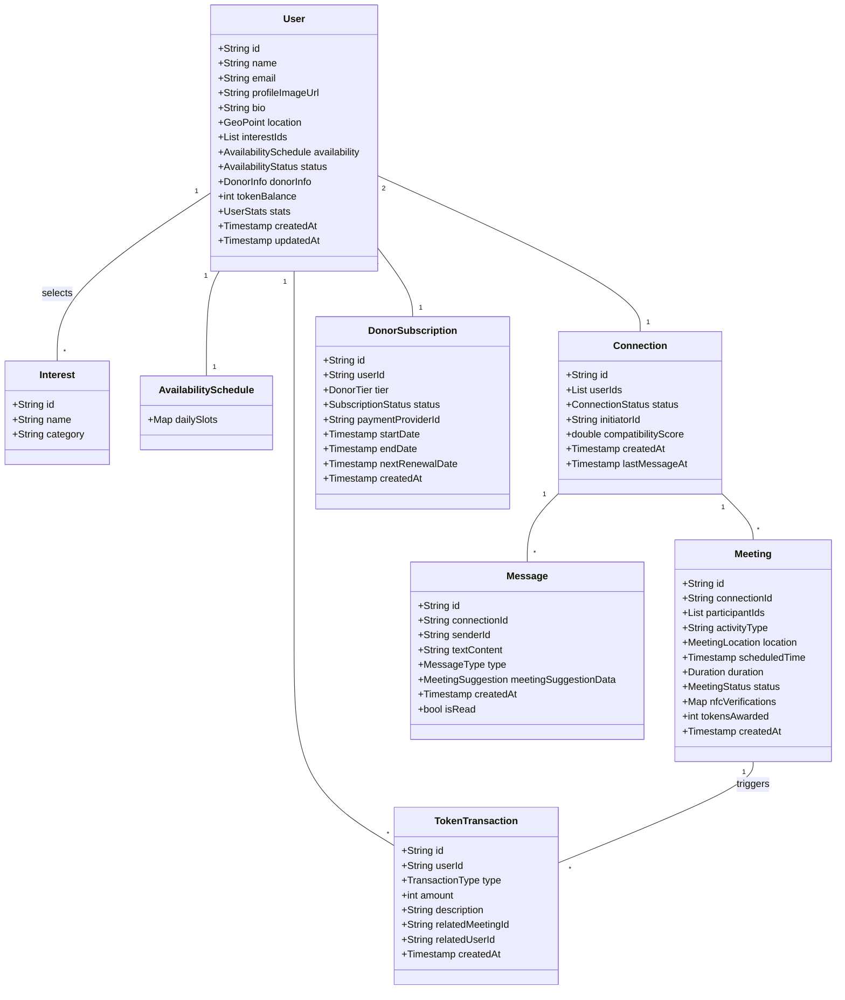

# Bond App - Comprehensive Development Plan

This document outlines the comprehensive development plan for implementing the Bond social meeting application using Flutter and Firebase. It covers architecture, folder structure, implementation phases, technical considerations, risks, and assumptions.

## 1. Project Goals

- Develop a cross-platform mobile application (iOS & Android) using Flutter.
- Implement core features: User Authentication, Profiles, Discovery, Connections, Meetings, Messaging, NFC Verification, Token Economy, Donor Subscriptions.
- Utilize Firebase for backend services (Auth, Firestore, Functions, Storage, Messaging).
- Integrate Algolia for efficient search and filtering.
- Ensure a scalable, secure, and reliable application architecture.
- Deliver an intuitive and engaging user experience based on provided wireframes and guidelines.

## 2. Project Architecture

A layered architecture using the BLoC pattern will be implemented for clear separation of concerns and testability.

```mermaid
graph TD
    A[Bond App] --> B[Presentation Layer UI]
    A --> C[Business Logic Layer BLoC]
    A --> D[Data Layer Repositories & Data Sources]
    A --> E[Core/Common Layer]
    A --> F[Service Layer External Integrations]

    B --> B1[Screens Pages]
    B --> B2[Widgets Reusable UI Components]
    B --> B3[Navigation GoRouter]
    B --> B4[Theme Material 3]

    C --> C1[Blocs/Cubits State Management]
    C --> C2[Events & States]

    D --> D1[Repositories Abstract Data Operations]
    D --> D2[Data Sources Local/Remote - Firebase, Hive]
    D --> D3[Models Data Structures]

    E --> E1[Utils Helper Functions]
    E --> E2[Constants App-wide constants]
    E --> E3[Extensions]
    E --> E4[Error Handling]
    E --> E5[Analytics Abstraction]

    F --> F1[Firebase Service Wrapper]
    F --> F2[Algolia Service Search]
    F --> F3[NFC Service Verification]
    F --> F4[Location Service Geo]
    F --> F5[Payment Service Stripe]
    F --> F6[Notification Service FCM]
```



## 3. Folder Structure

The project will follow a feature-first folder structure combined with layers.

```mermaid
graph TD
    Root[lib] --> App[app]
    Root --> Features[features]
    Root --> Core[core]
    Root --> Services[services]

    App --> AppMain[main.dart]
    App --> AppWidget[app.dart Root Widget]
    App --> Router[router GoRouter setup]
    App --> Theme[theme Theme definitions]
    App --> Config[config Environment config]

    Features --> Auth[auth]
    Features --> Profile[profile]
    Features --> Discovery[discovery]
    Features --> Connections[connections]
    Features --> Meetings[meetings]
    Features --> Messaging[messaging]
    Features --> TokenSystem[token_system]
    Features --> Donor[donor]
    Features --> Settings[settings]

    Auth --> AuthBloc[bloc auth_bloc.dart]
    Auth --> AuthData[data auth_repository.dart]
    Auth --> AuthModels[models user_model.dart]
    Auth --> AuthScreens[presentation/screens]
    Auth --> AuthWidgets[presentation/widgets]

    Core --> CommonWidgets[widgets buttons, cards, inputs]
    Core --> Utils[utils validators.dart]
    Core --> ErrorHandler[error exceptions.dart]
    Core --> DI[di dependency_injection.dart]
    Core --> Models[models shared data models]
    Core --> Analytics[analytics analytics_interface.dart]

    Services --> FirebaseSvc[firebase auth_service.dart]
    Services --> LocationSvc[location location_service.dart]
    Services --> NFCSvc[nfc nfc_service.dart]
    Services --> NotificationSvc[notifications notification_service.dart]
    Services --> AlgoliaSvc[algolia search_service.dart]
    Services --> PaymentSvc[payment stripe_service.dart]
```



**Detailed Folder Organization:**

```
lib/
├── app/
│   ├── main.dart                 # App entry point
│   ├── app.dart                  # Root application widget
│   ├── config/                   # Environment configuration
│   ├── constants.dart            # App-wide constants
│   ├── router/                   # Navigation setup (GoRouter)
│   └── theme/                    # Theme data and styles
├── core/
│   ├── analytics/                # Analytics abstraction layer
│   ├── di/                       # Dependency injection setup (get_it)
│   ├── error/                    # Custom exceptions and error handling
│   ├── models/                   # Core shared data models
│   ├── utils/                    # Utility functions
│   └── widgets/                  # Common reusable UI components (buttons, inputs, etc.)
├── features/                     # Feature modules
│   ├── auth/                     # Authentication feature
│   │   ├── bloc/                 # BLoC/Cubit for auth state
│   │   ├── data/                 # Repositories and data sources for auth
│   │   ├── models/               # Auth-specific models (if any)
│   │   └── presentation/         # Screens and widgets for auth UI
│   │       ├── screens/
│   │       └── widgets/
│   ├── profile/                  # User profile feature (...)
│   ├── discovery/                # User discovery feature (...)
│   ├── connections/              # User connections feature (...)
│   ├── meetings/                 # Meeting management feature (...)
│   ├── messaging/                # Chat/Messaging feature (...)
│   ├── token_system/             # Bond Token feature (...)
│   ├── donor/                    # Donor subscription feature (...)
│   └── settings/                 # App settings feature (...)
└── services/                     # Abstraction layer for external services
    ├── algolia/                  # Algolia search service
    ├── firebase/                 # Firebase services (Auth, Firestore, Storage, Functions proxy)
    ├── location/                 # Location/Geo services
    ├── nfc/                      # NFC service
    ├── notifications/            # Push notification service
    └── payment/                  # Payment gateway service (Stripe)
```

## 4. Data Models

Key data models will be defined in `core/models` or feature-specific `models` folders.



## 5. State Management

- **Primary State Management:** Flutter BLoC / Cubit.
- **Dependency Injection:** `get_it` for service location and dependency injection.
- State will be managed primarily within feature blocs, interacting with repositories. UI widgets will listen to bloc states and dispatch events.

## 6. Implementation Phases & Deliverables

### Phase 1: Core Foundation & Authentication (3 Months)

*   **Goal:** Establish project structure, core services, and user authentication flow.
*   **Tasks:**
    *   Project Setup (Flutter, Firebase, Git, CI/CD).
    *   Core Layer Implementation (Utils, Error Handling, DI, Theme).
    *   Firebase Service Wrappers (Auth, Firestore basics).
    *   Auth Feature:
        *   Auth BLoC/Repository.
        *   Login/Sign Up Screens (Email/Password).
        *   Social Login Integration (Google, Apple).
        *   User Session Management.
    *   Basic Profile Feature:
        *   Profile BLoC/Repository (Read/Write basic info).
        *   Profile Screen (View/Edit name, bio).
        *   Firestore User Collection Setup.
    *   Basic Navigation Setup (GoRouter).
    *   Unit & Widget Testing for Auth/Profile.
*   **Deliverables:** Functional authentication, basic profile view/edit, stable codebase foundation, CI/CD pipeline.

### Phase 2: Discovery, Connections & Basic Meetings (2 Months)

*   **Goal:** Implement user discovery, connection management, and initial meeting scheduling.
*   **Tasks:**
    *   Location Service Implementation (`geolocator`, permissions).
    *   Discovery Feature:
        *   Discovery BLoC/Repository.
        *   Map View Screen (`google_maps_flutter`).
        *   List View Screen.
        *   Basic Filters (Location radius).
        *   Display User Profiles (basic card).
        *   Firestore Geo-queries / Algolia Setup (Basic Indexing).
    *   Connections Feature:
        *   Connection BLoC/Repository.
        *   Send/Accept/Decline Connection Requests.
        *   Connections List Screen.
    *   Meetings Feature (Basic):
        *   Meeting BLoC/Repository (Create/View).
        *   Meeting Scheduling Screen (Select connection, time, basic details).
        *   Display Scheduled Meetings List.
    *   Testing for Discovery, Connections, Meetings.
*   **Deliverables:** Users can find others nearby, connect, and schedule basic meetings. Algolia integration initiated.

### Phase 3: Enhanced Features & Messaging (2 Months)

*   **Goal:** Implement advanced matching, full messaging, detailed meeting coordination, and token basics.
*   **Tasks:**
    *   Advanced Profile:
        *   Interest Selection/Management.
        *   Availability Schedule Setup.
        *   Profile Completion Logic.
    *   Compatibility Algorithm (Backend Function + Frontend Display).
    *   Advanced Discovery Filters (Interests, Availability).
    *   Messaging Feature:
        *   Messaging BLoC/Repository.
        *   Real-time Chat Screen (Firestore streams).
        *   Send/Receive Messages.
        *   Meeting Suggestion Cards in Chat.
        *   Push Notifications for New Messages (FCM).
    *   Enhanced Meetings:
        *   Activity Type Selection.
        *   Location Selection (Map integration).
        *   Meeting Details Screen.
    *   Token System (Basic):
        *   Token BLoC/Repository.
        *   Firestore structure for tokens/transactions.
        *   Display Token Balance.
    *   Testing for advanced features.
*   **Deliverables:** Compatibility scores shown, full chat functionality, detailed meeting scheduling, basic token display.

### Phase 4: Premium Features & Refinement (2 Months)

*   **Goal:** Implement NFC verification, donor system, search, and refine the application.
*   **Tasks:**
    *   NFC Service Implementation (`nfc_manager`).
    *   NFC Meeting Verification Flow.
    *   Token Awarding Logic (Cloud Function trigger on verification).
    *   Token Transaction History Screen.
    *   Donor Feature:
        *   Donor BLoC/Repository.
        *   Subscription Tier Selection Screen.
        *   Payment Integration (Stripe SDK).
        *   Backend webhook for subscription status updates.
        *   Donor Badge/Benefits display.
    *   Algolia Search Integration:
        *   Full user indexing (Cloud Function trigger).
        *   Search bar implementation.
        *   Advanced filtering via Algolia.
    *   Analytics Integration (Firebase Analytics).
    *   Crash Reporting Setup (Firebase Crashlytics).
    *   Performance Optimization & UI Polishing.
*   **Deliverables:** NFC verification working, users can subscribe as donors, advanced search functional, analytics integrated.

### Phase 5: Testing, Launch Prep & Release (1 Month)

*   **Goal:** Ensure application quality, prepare for store release, and launch.
*   **Tasks:**
    *   Comprehensive Testing:
        *   Unit, Widget, Integration Test finalization (~80% coverage target).
        *   End-to-End Testing (Manual and/or Automated).
        *   User Acceptance Testing (UAT).
        *   Security Audit/Penetration Testing (Basic).
    *   Bug Fixing & Final Optimizations.
    *   App Store/Play Store Asset Preparation.
    *   Submission & Review Process.
    *   Soft Launch & Monitoring.
    *   Address Feedback from Soft Launch.
    *   Full Public Launch.
*   **Deliverables:** Thoroughly tested application, App Store/Play Store listings, successful launch.

## 7. Technical Considerations

*   **Framework:** Flutter (Latest Stable Version)
*   **State Management:** Flutter BLoC / Cubit
*   **Navigation:** GoRouter
*   **Backend:** Firebase (Auth, Firestore, Functions, Storage, Messaging, Crashlytics, Analytics, App Check)
*   **Search:** Algolia
*   **Maps:** `google_maps_flutter`
*   **Location:** `geolocator`
*   **NFC:** `nfc_manager`
*   **HTTP Client:** `dio` (if needed beyond Firebase SDK)
*   **Local Storage:** `shared_preferences` (for simple prefs), `hive` (for caching)
*   **Payment:** Stripe (`flutter_stripe`)
*   **CI/CD:** GitHub Actions
*   **Linting:** `flutter_lints` / Custom rules
*   **Testing:** `flutter_test`, `bloc_test`, `integration_test`

## 8. Risk Management

| Risk                      | Likelihood | Impact | Mitigation Strategy                                                                 |
| :------------------------ | :--------- | :----- | :---------------------------------------------------------------------------------- |
| Firebase Cost Overruns    | Medium     | Medium | Monitor usage closely, optimize Firestore queries/reads, implement caching.         |
| NFC Compatibility Issues  | Medium     | High   | Test on diverse devices early, provide alternative verification (QR code?), clear user guidance. |
| Algolia Integration Complexity | Low        | Medium | Start integration early, utilize Algolia support/docs, potentially phase rollout.   |
| Scope Creep               | Medium     | High   | Strict change management process, prioritize features based on MVP, clear phases.  |
| Performance Bottlenecks   | Medium     | High   | Regular profiling (DevTools), optimize build methods, lazy loading, background processing. |
| Security Vulnerabilities  | Low        | High   | Follow Firebase security best practices, implement App Check, secure Cloud Functions, regular audits. |
| Third-Party API Changes   | Low        | Medium | Use stable API versions, create abstraction layers, monitor vendor announcements.     |
| Platform Specific Issues  | Medium     | Medium | Test thoroughly on both iOS & Android throughout development, use platform channels carefully. |
| Team Availability/Delays  | Low        | High   | Buffer time in estimates, clear task dependencies, regular communication.             |

## 9. Assumptions

*   Firebase and Algolia free/paid tiers meet initial performance and cost requirements.
*   NFC hardware is available and functional on target user devices.
*   Required API keys (Google Maps, Stripe, etc.) will be available.
*   Wireframes and design guidelines are finalized and approved.
*   Project requirements (MD files) are stable and approved.
*   Adequate testing devices (iOS/Android) are available.

## 10. Dependencies

*   **Phase 2 depends on Phase 1:** Core architecture and authentication are prerequisites.
*   **Messaging depends on Connections:** Users must be connected to message.
*   **NFC Verification depends on Meetings:** Meetings must be scheduled to be verified.
*   **Token Awarding depends on NFC Verification:** Successful verification triggers token awards.
*   **Donor Benefits depend on Donor Subscription:** Features unlocked after successful subscription.
*   **Advanced Search depends on Algolia Integration:** Algolia service must be set up.

## 11. Review and Approval

*   **Phase Reviews:** Conduct a review at the end of each major phase with stakeholders to demonstrate progress, gather feedback, and approve continuation.
*   **Code Reviews:** Implement mandatory peer code reviews for all significant changes via Pull Requests.
*   **Design Reviews:** Ensure UI implementation matches wireframes and guidelines periodically.

## 14. Related Documentation

The following related documentation is available in the `docs` directory:

- [Project Requirements](docs/bond-project-requirements.md) - Detailed business goals and functional requirements
- [App Flow Documentation](docs/bond-app-flow-doc.md) - User journey and screen transitions
- [Technology Stack](docs/bond-tech-stack-doc.md) - Comprehensive technology stack information
- [Backend Structure](docs/bond-backend-structure-doc.md) - Database schema and backend architecture
- [Frontend Guidelines](docs/bond-frontend-guidelines.md) - UI/UX standards and component guidelines

## 15. Wireframes

Reference wireframes for key screens are available in the `wireframes` directory:

1. Home/Events Screen
2. See & Meet Compatibility Screen
3. Connection Flow
4. NFC Verification Process
5. User Profile Management
6. Other User Profiles

These wireframes provide visual guidance for the implementation of the UI components.

This plan provides a roadmap for the Bond app development. Flexibility will be required to adapt to challenges and new information as the project progresses.
