# Bond App - App Flow Document

## 1. Overview

This document outlines the detailed user flows and screen transitions for the Bond social meeting application. It serves as a guide for developers and designers to understand the full user journey through the app and ensure a consistent, intuitive user experience.

## 2. User Journey Map

The following diagram illustrates the high-level user journey through the Bond app:

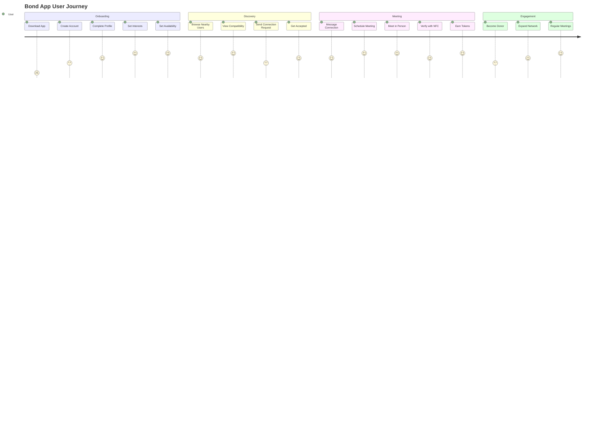

## 3. App Entry Flow

### 3.1 App Launch and Onboarding

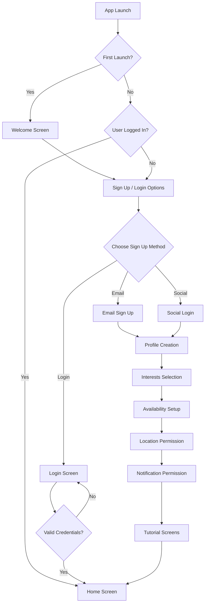

### 3.2 Profile Creation Flow

The profile creation process follows these steps after authentication:

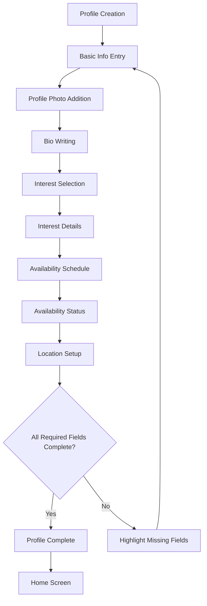

## 4. Main Navigation Flow

### 4.1 Tab Bar Navigation

The app uses a bottom tab bar for primary navigation between main sections:

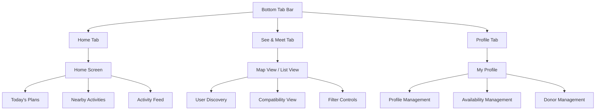

### 4.2 Screen Stack Navigation

The navigation hierarchy within each tab follows these patterns:

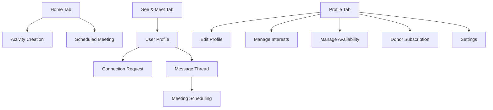

## 5. Discovery and Connection Flow

### 5.1 User Discovery

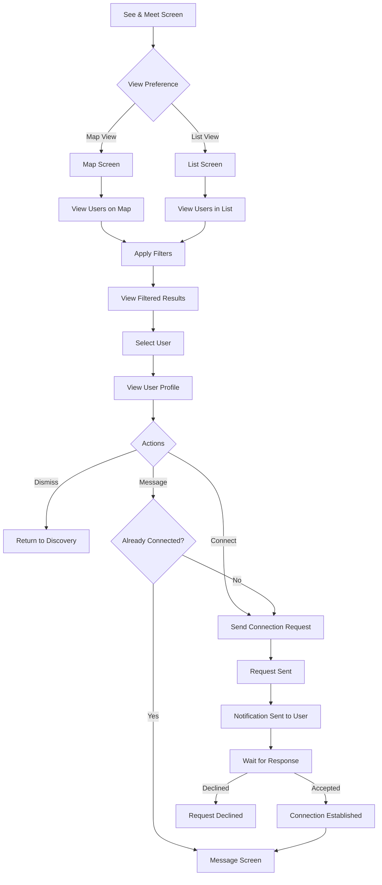

### 5.2 Compatibility View

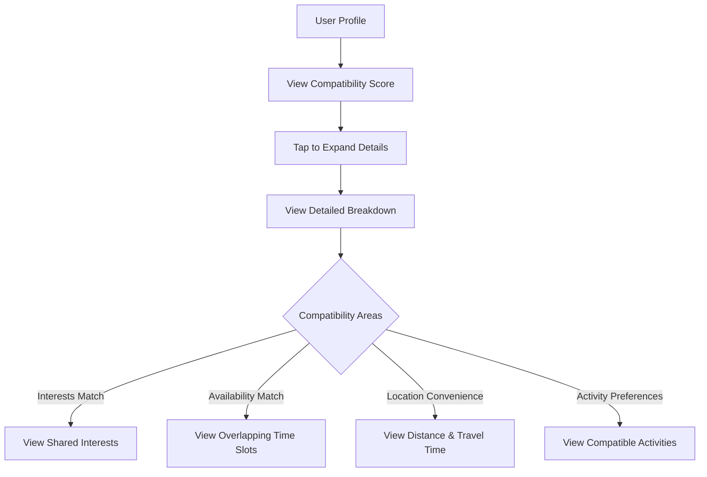

## 6. Messaging and Meeting Flow

### 6.1 Messaging Flow

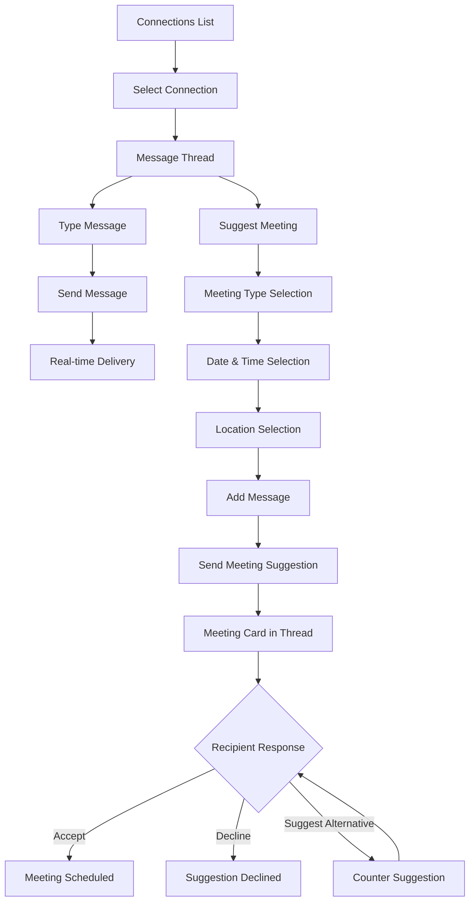

### 6.2 Meeting Organization

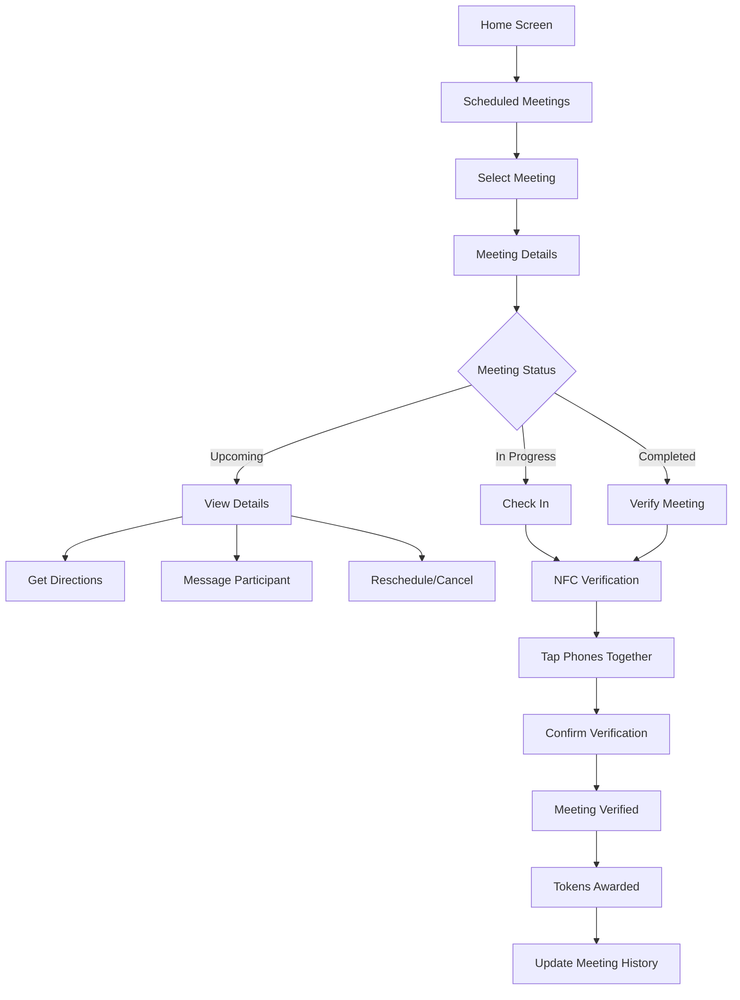

### 6.3 NFC Verification Process

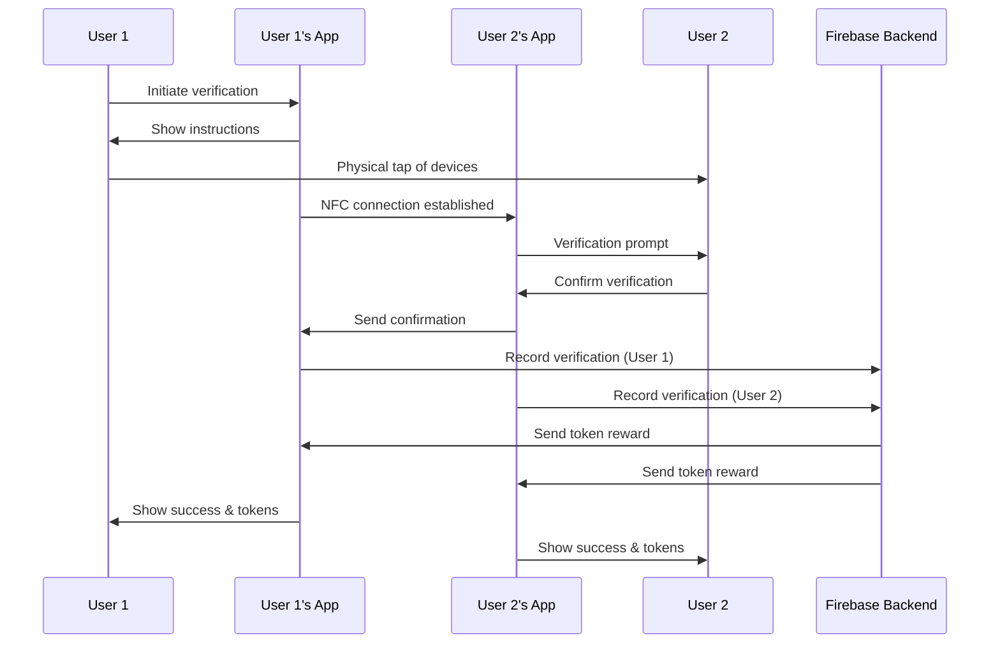

## 7. Profile and Settings Management

### 7.1 Profile Management Flow

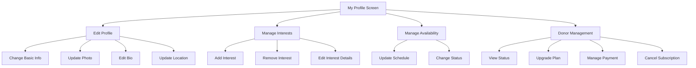

### 7.2 Settings Flow

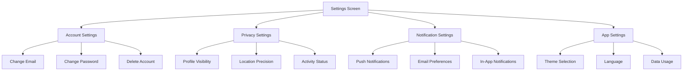

## 8. Donor Subscription Flow

### 8.1 Subscription Management

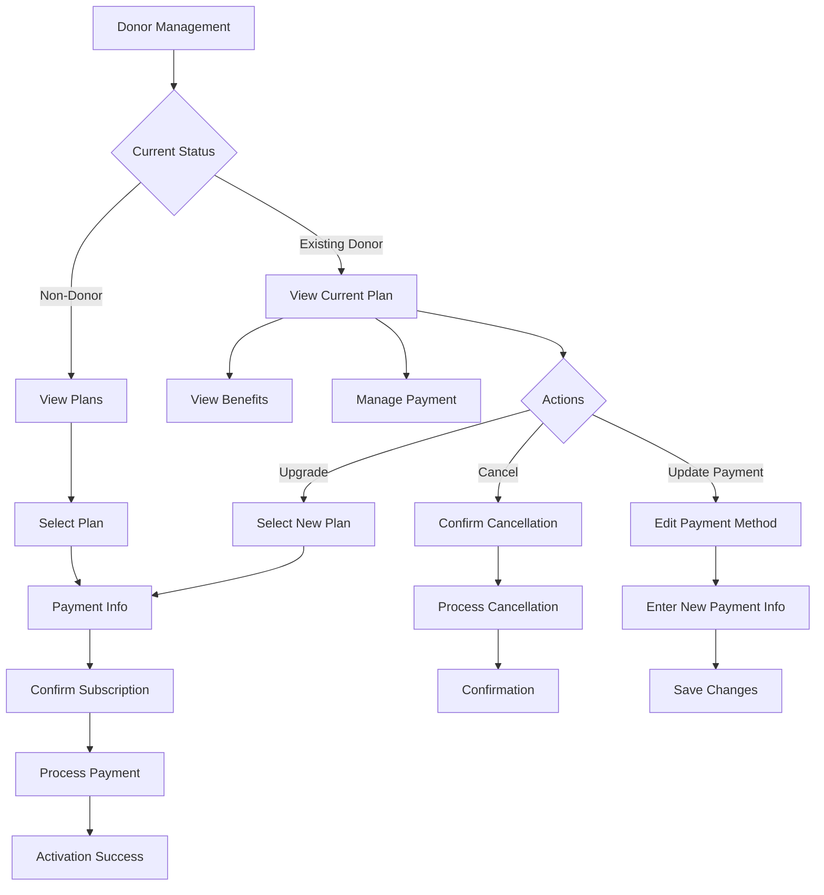

### 8.2 Benefits Activation

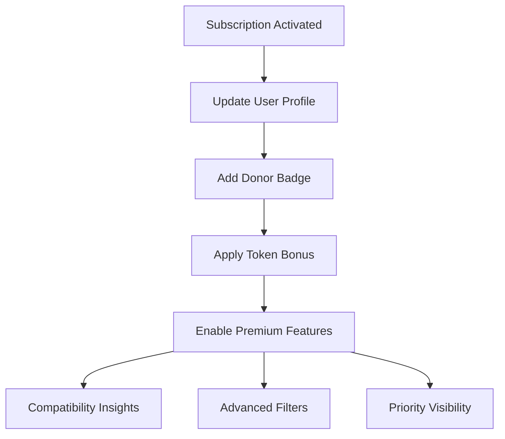

## 9. Token Economy Flow

### 9.1 Token Earning & Spending

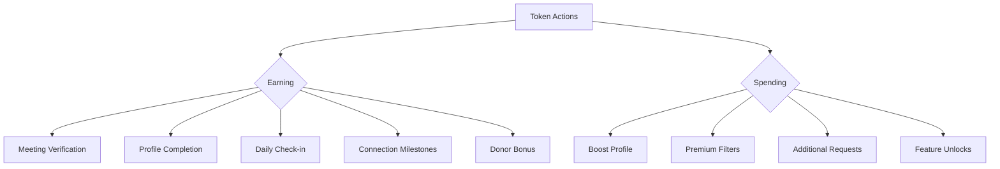

### 9.2 Token Transaction Flow

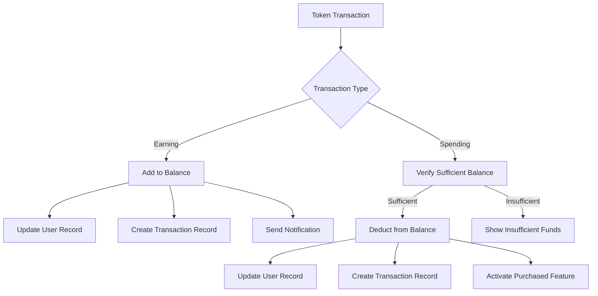

## 10. Error Handling and Recovery Flows

### 10.1 Network Error Recovery

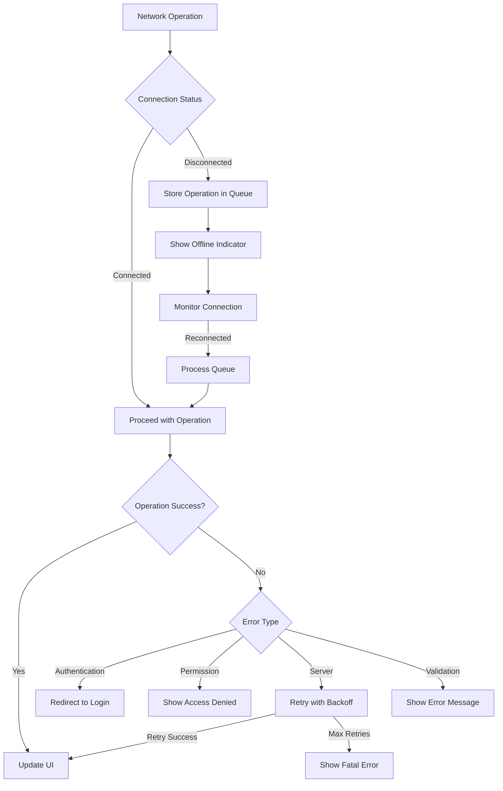

### 10.2 Authentication Error Flow

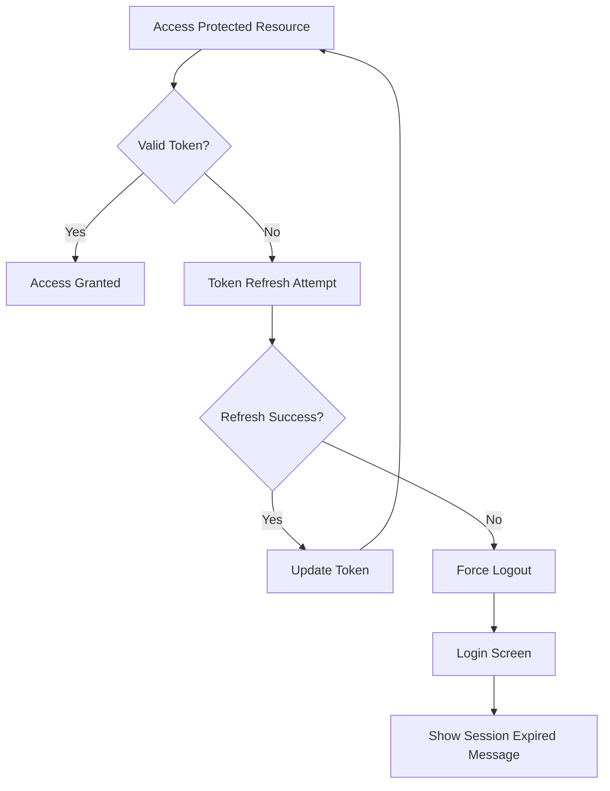

## 11. Notification Flows

### 11.1 Push Notification Handling

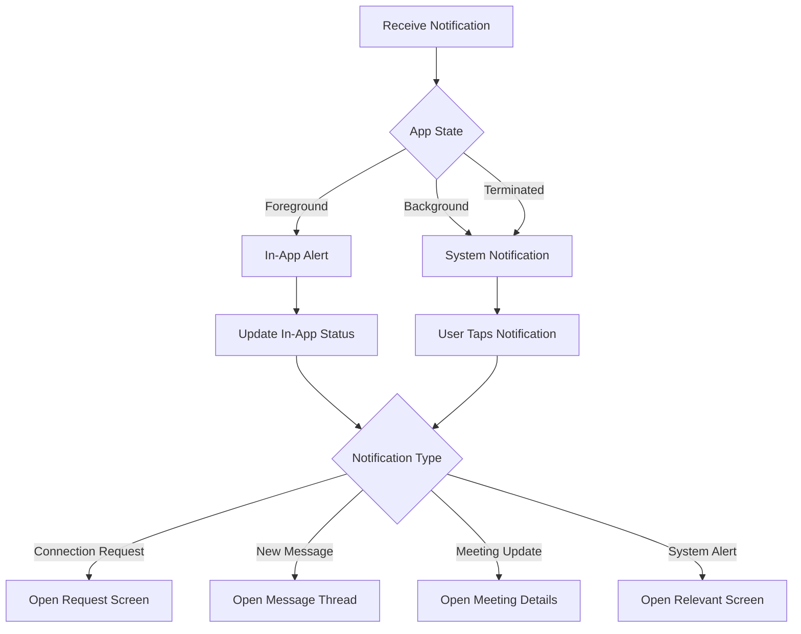

### 11.2 In-App Notification Center

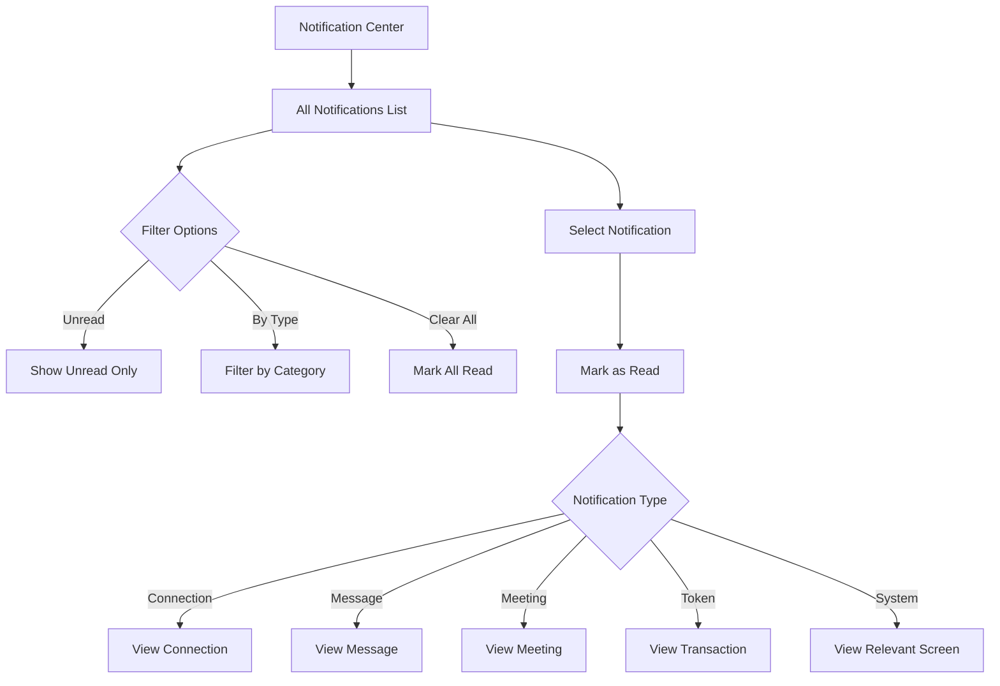

## 12. Conditional Flows and Edge Cases

### 12.1 First-Time User vs. Returning User

```mermaid
flowchart TD
    A[App Launch] --> B{First Launch?}
    B -->|Yes| C[Welcome Tutorial]
    B -->|No| D{Profile Complete?}
    
    C --> E[Sign Up Flow]
    D -->|Yes| F[Home Screen]
    D -->|No| G[Continue Profile Setup]
    G --> H{Missing Sections}
    H -->|Interests| I[Interest Selection]
    H -->|Availability| J[Set Availability]
    H -->|Location| K[Location Setup]
    
    I & J & K --> L[Check Completion]
    L -->|Complete| F
    L -->|Incomplete| G
```

### 12.2 Meeting Cancellation Flow

```mermaid
flowchart TD
    A[Scheduled Meeting] --> B{Cancellation Request}
    B -->|By Organizer| C[Meeting Canceled]
    B -->|By Participant| D[Cancellation Request]
    
    C --> E[Remove from Calendar]
    C --> F[Notify All Participants]
    F --> G[Update Meeting Status]
    
    D --> H[Notify Organizer]
    H --> I{Organizer Response}
    I -->|Accept Cancellation| C
    I -->|Reschedule| J[Propose New Time]
    I -->|Decline Cancellation| K[Meeting Remains Scheduled]
    J --> L[New Scheduling Flow]
```

### 12.3 Connection Management Flow

```mermaid
flowchart TD
    A[Connection List] --> B{Manage Connection}
    B -->|View Details| C[Connection Details]
    B -->|Message| D[Message Thread]
    B -->|Remove| E[Confirm Removal]
    
    C --> F[View History]
    C --> G[Meeting Stats]
    C --> H[Compatibility Details]
    
    E -->|Confirm| I[Remove Connection]
    E -->|Cancel| A
    
    I --> J[Update Connection Status]
    J --> K[Remove from List]
    K --> L[Return to Connections]
```

## 13. Administrative Flows

### 13.1 User Reporting Flow

```mermaid
flowchart TD
    A[User Profile] --> B[Report User]
    B --> C[Select Reason]
    C --> D[Add Details]
    D --> E[Submit Report]
    E --> F[Report Acknowledgment]
    F --> G[Return to Previous Screen]
    
    E --> H[Create Report Record]
    H --> I[Admin Review Queue]
    I --> J{Review Decision}
    J -->|No Action| K[Close Report]
    J -->|Warning| L[Issue Warning]
    J -->|Suspension| M[Suspend Account]
    J -->|Ban| N[Ban Account]
```

### 13.2 Support and Help Flow

```mermaid
flowchart TD
    A[Settings Screen] --> B[Help & Support]
    B --> C{Support Options}
    C -->|FAQ| D[View FAQ Articles]
    C -->|Contact| E[Contact Form]
    C -->|Report Bug| F[Bug Report Form]
    
    D --> G[Select Topic]
    G --> H[View Article]
    
    E --> I[Describe Issue]
    I --> J[Submit Ticket]
    J --> K[Ticket Confirmation]
    
    F --> L[Describe Bug]
    L --> M[Attach Screenshots]
    M --> N[Submit Report]
    N --> O[Report Confirmation]
```

## 14. Analytics Events

Throughout the user flows, the following key analytics events are tracked:

1. **Onboarding Events**:
   - app_first_open
   - sign_up_started
   - sign_up_completed
   - profile_created
   - interests_selected
   - availability_set
   - location_permission_granted
   - tutorial_completed

2. **Engagement Events**:
   - user_login
   - view_home_screen
   - view_discovery_screen
   - view_profile_screen
   - connection_request_sent
   - connection_request_accepted
   - connection_request_declined
   - message_sent
   - meeting_scheduled
   - meeting_verified
   - token_earned
   - token_spent

3. **Subscription Events**:
   - subscription_view
   - subscription_start
   - subscription_upgraded
   - subscription_renewed
   - subscription_cancelled
   - payment_success
   - payment_failed

4. **Feature Usage Events**:
   - map_view_used
   - list_view_used
   - filter_applied
   - search_performed
   - compatibility_viewed
   - profile_edited
   - availability_updated
   - interests_updated

These events help track user progression through the app flows and provide insights into feature usage and conversion points.

## 15. Success Metrics

The effectiveness of these app flows will be measured using the following metrics:

1. **Onboarding Completion Rate**: Percentage of users who complete the full onboarding process
2. **Connection Request Acceptance Rate**: Percentage of connection requests that are accepted
3. **Meeting Completion Rate**: Percentage of scheduled meetings that are verified as completed
4. **Message Response Rate**: Average response rate for messages sent between connections
5. **Donor Conversion Rate**: Percentage of active users who become donors
6. **Token Economy Balance**: Ratio of tokens earned vs. spent across the platform
7. **Retention Rate**: User retention at 1-day, 7-day, 30-day, and 90-day marks
8. **Daily Active Users (DAU)**: Number of unique users who engage with the app daily
9. **Feature Adoption**: Percentage of users who utilize specific features

These metrics will be tracked and analyzed to identify bottlenecks in the user flows and opportunities for optimization.
