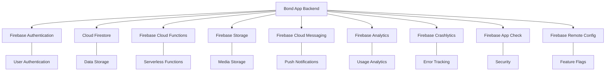
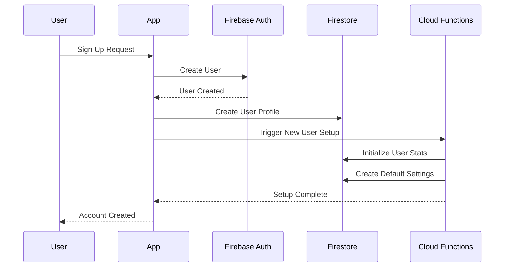
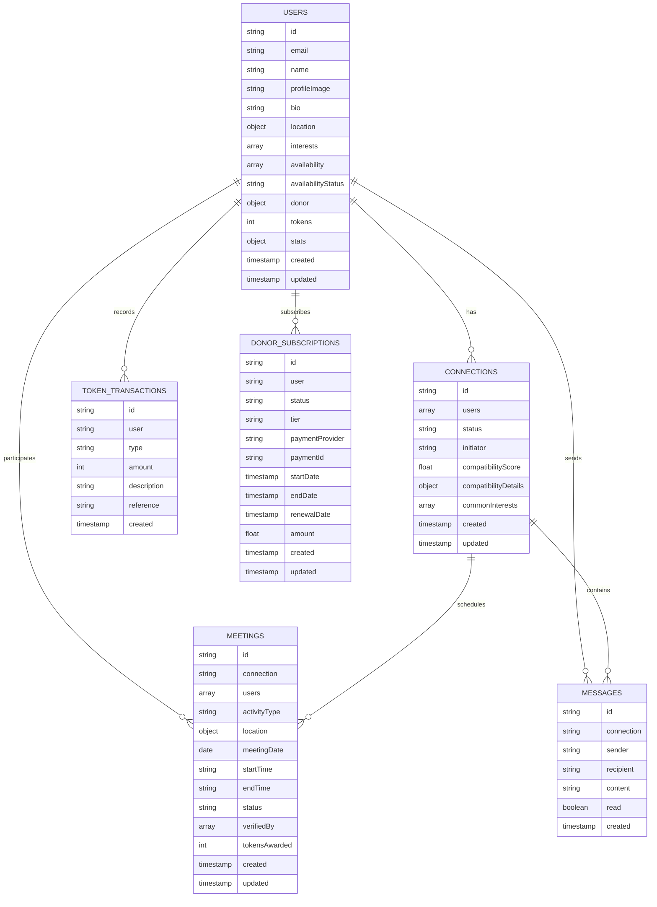
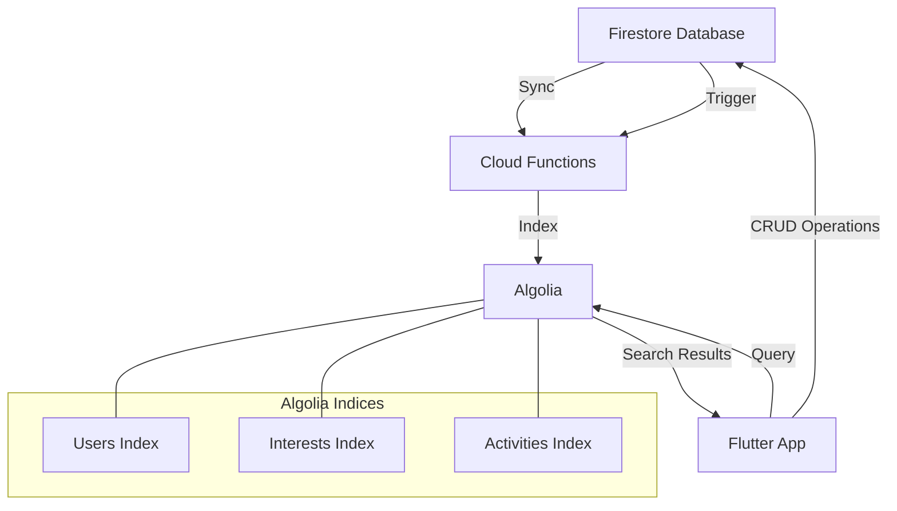
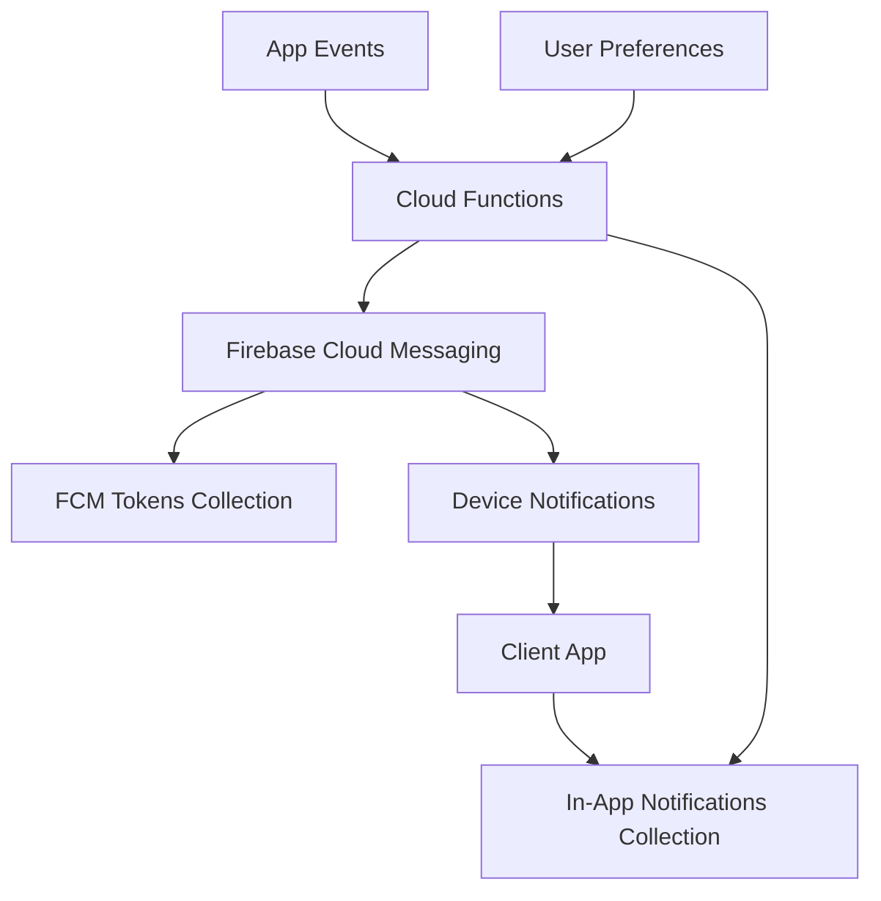
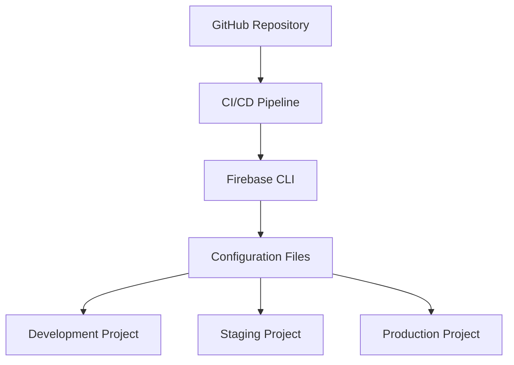
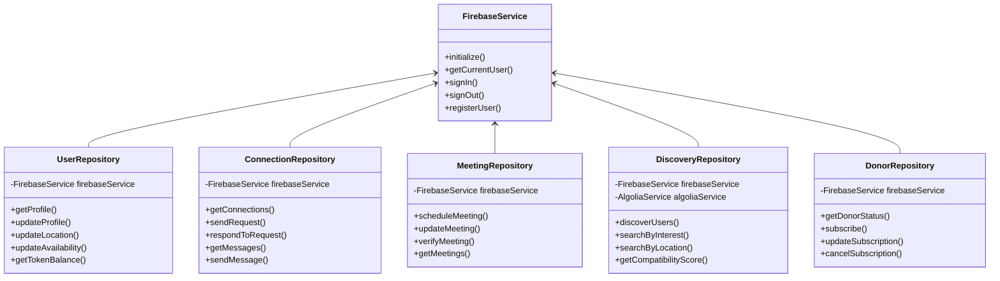

# Bond App - Backend Structure Document

## 1. Overview

This document outlines the backend architecture for the Bond social meeting application, which utilizes Firebase as the primary backend service. The architecture is designed to support real-time interactions, scalable user discovery, secure authentication, and efficient data management across all app features.

## 2. Firebase Architecture

### 2.1 Firebase Services

The Bond app leverages multiple Firebase services to create a comprehensive backend:



### 2.2 Firebase Project Structure

The Bond app uses multiple Firebase projects to separate development environments:

- **Development**: For ongoing development and testing
- **Staging**: For pre-production testing with production-like data
- **Production**: The live production environment

Each project maintains the same overall structure but with environment-specific configurations.

## 3. Authentication System

### 3.1 Authentication Methods

Firebase Authentication provides the following authentication methods:

- Email and password
- Google Sign-In
- Apple Sign-In
- Facebook Sign-In
- Phone number verification (as backup)

### 3.2 User Management



### 3.3 Security Rules

Firebase Authentication security rules control access to user data:

```javascript
// Example Firestore security rules
rules_version = '2';
service cloud.firestore {
  match /databases/{database}/documents {
    match /users/{userId} {
      allow read: if request.auth != null && (request.auth.uid == userId || 
                   exists(/databases/$(database)/documents/users/$(request.auth.uid)/connections/$(userId)));
      allow write: if request.auth != null && request.auth.uid == userId;
      
      match /privateData/{document=**} {
        allow read, write: if request.auth != null && request.auth.uid == userId;
      }
    }
  }
}
```

## 4. Database Design

### 4.1 Firestore Collections



### 4.2 Collection Structure and Indexing

Firebase Firestore collections will be structured with a focus on query efficiency and scalability:

#### Users Collection
```
users/{userId}/
  - basic profile information
  - location data (for geoqueries)
  - availability status
  - token balance
  - stats summary

users/{userId}/interests/{interestId}/
  - detailed interest information
  - experience level
  - proficiency

users/{userId}/availability/{dayId}/
  - specific availability time slots
  - recurring preferences

users/{userId}/connections/{connectionId}/
  - connection reference
  - last interaction timestamp
  - unread message count

users/{userId}/tokenTransactions/{transactionId}/
  - transaction history
  - running balance
```

#### Connections Collection
```
connections/{connectionId}/
  - user references (both parties)
  - connection status
  - compatibility score
  - last interaction timestamp

connections/{connectionId}/messages/{messageId}/
  - message content
  - timestamp
  - read status
```

#### Meetings Collection
```
meetings/{meetingId}/
  - meeting details
  - location information
  - scheduled time
  - verification status
  - participants
```

#### Indexes
The following compound indexes will be created for efficient queries:

1. **User Discovery Index**: 
   - Collection: `users`
   - Fields: `availabilityStatus` (ascending), `location.geohash` (ascending)

2. **Connection Management Index**: 
   - Collection: `connections`
   - Fields: `users` (array-contains), `status` (ascending), `updated` (descending)

3. **Meeting Organization Index**: 
   - Collection: `meetings`
   - Fields: `users` (array-contains), `meetingDate` (ascending), `status` (ascending)

4. **Message History Index**: 
   - Collection: `connections/{connectionId}/messages`
   - Fields: `created` (descending)

5. **Transaction History Index**:
   - Collection: `users/{userId}/tokenTransactions`
   - Fields: `created` (descending), `type` (ascending)

### 4.3 Data Denormalization Strategy

To optimize read performance, certain data will be denormalized:

1. **User Profiles**: Basic profile information duplicated in connection and meeting documents
2. **Connection Status**: Status mirrored in both users' connection subcollections
3. **Meeting Details**: Basic meeting information duplicated in user-specific views
4. **Compatibility Scores**: Pre-calculated and stored in connection documents
5. **Statistics**: Aggregated counters maintained for common queries

The denormalization strategy follows these principles:
- Duplicate data only when it significantly improves read performance
- Ensure write operations update all duplicated data atomically
- Use Cloud Functions to maintain data consistency
- Document denormalization patterns in code comments

### 4.4 Data Migration and Evolution Strategy

As the application evolves, the database schema will need to evolve with it:

1. **Version Tracking**: Each document contains a schema version field
2. **Migration Cloud Functions**: Automatic data migration when schema changes
3. **Backward Compatibility**: Support for reading older document formats
4. **Feature Flags**: Remote Config flags to control feature rollout with schema changes
5. **Staged Rollout**: Incremental migration to minimize risks

## 5. Cloud Functions Architecture

### 5.1 Function Organization

Cloud Functions will be organized by domain and trigger type:

```mermaid
flowchart TD
    A[Cloud Functions] --> B[Authentication Functions]
    A --> C[User Functions]
    A --> D[Connection Functions]
    A --> E[Meeting Functions]
    A --> F[Notification Functions]
    A --> G[Token Functions]
    A --> H[Subscription Functions]
    A --> I[Admin Functions]
    A --> J[Algolia Sync Functions]
    
    B --> B1[onUserCreate]
    B --> B2[onUserDelete]
    
    C --> C1[onProfileUpdate]
    C --> C2[onLocationUpdate]
    C --> C3[onAvailabilityUpdate]
    
    D --> D1[onConnectionRequest]
    D --> D2[onConnectionAccept]
    D --> D3[onConnectionDecline]
    
    E --> E1[onMeetingCreate]
    E --> E2[onMeetingUpdate]
    E --> E3[onMeetingVerify]
    
    F --> F1[onMessageCreate]
    F --> F2[onUserStatusChange]
    F --> F3[onMeetingReminder]
    
    G --> G1[onTokenAward]
    G --> G2[onTokenSpend]
    
    H --> H1[onSubscriptionCreate]
    H --> H2[onSubscriptionRenew]
    H --> H3[onSubscriptionCancel]
    
    I --> I1[scheduledDataCleanup]
    I --> I2[scheduledMetricsGeneration]
    
    J --> J1[onUserProfileChange]
    J --> J2[onUserAvailabilityChange]
    J --> J3[onUserLocationChange]
```



### 5.2 Function Types

Cloud Functions will be implemented using different trigger types:

1. **HTTP Triggers**:
   - API endpoints for client operations
   - Webhook integrations for payment processing
   - Admin operations

2. **Firestore Triggers**:
   - Document creation/update/delete handlers
   - Data validation and transformation
   - Cascading updates for denormalized data

3. **Authentication Triggers**:
   - User creation workflows
   - Profile deletion handling
   - Account linking

4. **Scheduled Functions**:
   - Daily analytics aggregation
   - Stale data cleanup
   - Automated reminders
   - Subscription renewal checks

5. **Pub/Sub Functions**:
   - Cross-function communication
   - Event-driven workflows
   - Asynchronous processing

### 5.3 Function Examples

#### Example 1: User Creation Workflow
```javascript
exports.onUserCreate = functions.auth.user().onCreate(async (user) => {
  try {
    // Create user profile document
    await admin.firestore().collection('users').doc(user.uid).set({
      email: user.email,
      name: user.displayName || '',
      profileImage: user.photoURL || '',
      bio: '',
      location: { geohash: '', lat: 0, lng: 0 },
      availabilityStatus: 'unavailable',
      tokens: 50, // Starting balance
      donor: { status: 'none', since: null, renewalDate: null, amount: 0 },
      stats: { connections: 0, meetings: 0, rating: 0 },
      created: admin.firestore.FieldValue.serverTimestamp(),
      updated: admin.firestore.FieldValue.serverTimestamp(),
      schemaVersion: 1
    });
    
    // Create token transaction for starting balance
    await admin.firestore().collection('users').doc(user.uid)
      .collection('tokenTransactions').add({
        type: 'welcome',
        amount: 50,
        description: 'Welcome bonus',
        reference: null,
        created: admin.firestore.FieldValue.serverTimestamp()
      });
      
    // Send welcome notification
    await admin.messaging().send({
      token: user.fcmToken,
      notification: {
        title: 'Welcome to Bond!',
        body: 'Your account has been created successfully.'
      }
    });
  } catch (error) {
    console.error('Error creating user profile:', error);
  }
});
```

#### Example 2: Meeting Verification
```javascript
exports.onMeetingVerify = functions.firestore
  .document('meetings/{meetingId}/verifications/{userId}')
  .onCreate(async (snap, context) => {
    const { meetingId, userId } = context.params;
    
    try {
      // Get meeting document
      const meetingRef = admin.firestore().collection('meetings').doc(meetingId);
      const meetingDoc = await meetingRef.get();
      const meeting = meetingDoc.data();
      
      // Check if both users have verified
      const verifications = await meetingRef.collection('verifications').get();
      const verifiedUserIds = verifications.docs.map(doc => doc.id);
      
      // If all participants have verified
      if (verifiedUserIds.length === meeting.users.length) {
        const tokensPerUser = 100;
        const batch = admin.firestore().batch();
        
        // Update meeting status
        batch.update(meetingRef, { 
          status: 'verified',
          verifiedBy: verifiedUserIds,
          tokensAwarded: tokensPerUser * meeting.users.length,
          updated: admin.firestore.FieldValue.serverTimestamp()
        });
        
        // Award tokens to each participant
        for (const participantId of meeting.users) {
          // Update user token balance
          const userRef = admin.firestore().collection('users').doc(participantId);
          batch.update(userRef, {
            tokens: admin.firestore.FieldValue.increment(tokensPerUser),
            'stats.meetings': admin.firestore.FieldValue.increment(1),
            updated: admin.firestore.FieldValue.serverTimestamp()
          });
          
          // Create token transaction record
          const transactionRef = userRef.collection('tokenTransactions').doc();
          batch.set(transactionRef, {
            type: 'meeting_verified',
            amount: tokensPerUser,
            description: 'Meeting verification reward',
            reference: meetingId,
            created: admin.firestore.FieldValue.serverTimestamp()
          });
          
          // Send notification
          await admin.messaging().send({
            token: (await userRef.get()).data().fcmToken,
            notification: {
              title: 'Meeting Verified!',
              body: `You earned ${tokensPerUser} Bond Tokens for your meeting.`
            },
            data: {
              type: 'meeting_verified',
              meetingId: meetingId
            }
          });
        }
        
        await batch.commit();
      }
    } catch (error) {
      console.error('Error processing meeting verification:', error);
    }
  });
```

### 5.4 Function Deployment Strategy

Cloud Functions will be deployed using the following strategy:

1. **Environment-Specific Deployments**:
   - Separate deployments for development, staging, and production
   - Environment variables for configuration differences

2. **Gradual Rollouts**:
   - Deploy to development for initial testing
   - Staged promotion to staging and production
   - Canary deployments for critical functions

3. **Versioning**:
   - Functions versioned with application releases
   - Backward compatibility maintained between versions
   - Clear deprecation process for replaced functions

4. **Monitoring and Alerting**:
   - Performance monitoring for all functions
   - Error rate alerting
   - Cost monitoring for high-usage functions

## 6. Algolia Integration

### 6.1 Algolia Architecture

Algolia will be used to power the app's search and discovery features, with Firebase keeping Algolia indices in sync:



### 6.2 Index Structure

#### Users Index
```json
{
  "objectID": "user123",
  "name": "John Davis",
  "bio": "Tech enthusiast and coffee lover...",
  "interests": ["coffee", "tennis", "technology", "food", "hiking"],
  "interestDetails": [
    {"name": "coffee", "level": "enthusiast"},
    {"name": "tennis", "level": "intermediate"}
  ],
  "availabilityStatus": "available",
  "location": {
    "_geoloc": {
      "lat": 37.7749,
      "lng": -122.4194
    }
  },
  "donor": {
    "status": "silver"
  },
  "stats": {
    "connections": 23,
    "meetings": 15,
    "rating": 4.9
  },
  "active": true,
  "lastActive": 1622505600
}
```

#### Interests Index
```json
{
  "objectID": "interest123",
  "name": "Coffee",
  "category": "Food & Drink",
  "popularity": 85,
  "userCount": 1240,
  "keywords": ["espresso", "latte", "cappuccino", "beans", "brewing"],
  "activities": ["coffee tasting", "cafe hopping", "home brewing"]
}
```

#### Activities Index
```json
{
  "objectID": "activity123",
  "name": "Coffee Chat",
  "category": "Social",
  "relatedInterests": ["coffee", "conversation", "networking"],
  "popularity": 92,
  "averageDuration": 60,
  "locations": ["cafe", "coffee shop", "lounge"],
  "description": "Casual conversation over coffee"
}
```

### 6.3 Sync Strategy

Algolia indices will be kept in sync with Firestore using Cloud Functions:

1. **Real-time Updates**:
   - Trigger functions on document changes
   - Batch updates for efficiency
   - Prioritize critical fields for immediate sync

2. **Bulk Updates**:
   - Scheduled full reindex for consistency
   - Chunked processing for large datasets
   - Progress tracking for long-running operations

3. **Error Handling**:
   - Retry mechanism for failed operations
   - Dead-letter queue for manual intervention
   - Monitoring and alerting for sync failures

### 6.4 Search Optimization

Algolia search will be optimized for the Bond app's specific needs:

1. **Custom Ranking**:
   - Primary: Compatibility score
   - Secondary: Distance/location
   - Tertiary: Availability (available now first)
   - Quaternary: Activity level (recent activity prioritized)

2. **Faceting Strategy**:
   - Interests as facets for filtering
   - Availability status as a facet
   - Donor status as a facet
   - Activity types as facets

3. **Geo-Search**:
   - Location-based search with radius filtering
   - Dynamic radius based on population density
   - Location clustering for map view

## 7. Storage Architecture

### 7.1 Storage Organization

Firebase Storage will be organized into the following structure:

```
bond-app/
├── profile-images/
│   └── {userId}/
│       ├── profile.jpg
│       └── thumbnails/
│           ├── small.jpg
│           └── medium.jpg
├── interest-images/
│   └── {interestId}/
│       └── icon.svg
├── meeting-verification/
│   └── {meetingId}/
│       └── {userId}/
│           └── verification.jpg
└── app-assets/
    ├── icons/
    ├── illustrations/
    └── marketing/
```

### 7.2 Storage Security Rules

```javascript
// Firebase Storage security rules
rules_version = '2';
service firebase.storage {
  match /b/{bucket}/o {
    match /profile-images/{userId}/{allImages=**} {
      allow read: if request.auth != null;
      allow write: if request.auth != null && request.auth.uid == userId;
    }
    
    match /meeting-verification/{meetingId}/{userId}/{allFiles=**} {
      allow read: if request.auth != null && 
                   exists(/databases/$(database)/documents/meetings/$(meetingId)/users/$(request.auth.uid));
      allow write: if request.auth != null && request.auth.uid == userId;
    }
    
    match /interest-images/{interestId}/{allImages=**} {
      allow read: if request.auth != null;
      allow write: if request.auth != null && request.auth.token.admin == true;
    }
    
    match /app-assets/{allAssets=**} {
      allow read: if request.auth != null;
      allow write: if false; // Admin-only through deployment
    }
  }
}
```

### 7.3 Media Processing

Media files will be processed using Cloud Functions:

1. **Image Optimization**:
   - Resize profile images to standard dimensions
   - Generate thumbnails for different contexts
   - Optimize for file size and quality

2. **Content Moderation**:
   - Scan uploaded images for inappropriate content
   - Blur or reject problematic images
   - Flag for manual review when necessary

3. **Metadata Generation**:
   - Extract EXIF data when relevant
   - Generate content hashes for deduplication
   - Add application-specific metadata

## 8. Notification System

### 8.1 Notification Architecture



### 8.2 Notification Types

The following notification types will be implemented:

1. **Connection Notifications**:
   - New connection requests
   - Request accepted/declined
   - Connection milestones

2. **Meeting Notifications**:
   - Meeting invitations
   - Meeting reminders (24h, 1h before)
   - Meeting updates (location, time changes)
   - Meeting verification reminders

3. **Message Notifications**:
   - New messages
   - Message reactions
   - Meeting suggestions

4. **Activity Notifications**:
   - Nearby high-compatibility users
   - Users becoming available
   - Popular activities in your area

5. **Token Notifications**:
   - Token rewards
   - Token milestone achievements
   - Donor benefits activated

### 8.3 Notification Delivery

Notifications will be delivered through multiple channels:

1. **Push Notifications**:
   - Firebase Cloud Messaging
   - Rich notifications with images and actions
   - Silent notifications for data sync

2. **In-App Notifications**:
   - Stored in Firestore for persistence
   - Real-time updates via listeners
   - Notification center for history

3. **Email Notifications**:
   - Weekly digests of activity
   - Important account updates
   - Re-engagement campaigns

## 9. Security Architecture

### 9.1 Authentication Security

1. **Multi-factor Authentication**:
   - Optional for user accounts
   - Required for administrative actions
   - Phone verification as second factor

2. **Session Management**:
   - Automatic token refresh
   - Configurable session timeouts
   - Forced logout for suspicious activity

3. **Social Authentication Security**:
   - Verified email requirements
   - Account linking safeguards
   - Provider token validation

### 9.2 Data Security

1. **Security Rules**:
   - Granular Firestore security rules
   - Storage access control
   - Function authentication

2. **Data Encryption**:
   - Encryption at rest (Firebase default)
   - Encrypted fields for sensitive data
   - Client-side encryption for messages

3. **Privacy Controls**:
   - User-controlled visibility settings
   - Location precision controls
   - Data retention policies

### 9.3 Fraud Prevention

1. **Rate Limiting**:
   - Cloud Function rate limits
   - Token earning limits
   - Connection request throttling

2. **Verification Validation**:
   - NFC proximity verification
   - Timestamp analysis
   - Location validation for meetings

3. **Account Protection**:
   - Suspicious activity detection
   - Account recovery processes
   - Ban mechanisms for abusive users

## 10. Monitoring and Analytics

### 10.1 Performance Monitoring

1. **Key Metrics**:
   - API response times
   - Function execution durations
   - Database query performance
   - Client-side performance

2. **Alerting**:
   - Error rate thresholds
   - Performance degradation alerts
   - Usage spike notifications

3. **Logging**:
   - Structured logging format
   - Log levels for filtering
   - Sensitive data redaction

### 10.2 Analytics Implementation

Firebase Analytics will track the following metrics:

1. **User Engagement**:
   - Active users (daily, weekly, monthly)
   - Session duration and frequency
   - Feature usage patterns
   - Retention and churn rates

2. **Social Metrics**:
   - Connection request rate and acceptance
   - Message volume and response rates
   - Meeting scheduling and completion rates
   - Verification success rates

3. **Business Metrics**:
   - Donor conversion rates
   - Subscription retention
   - Token economy metrics
   - Revenue per user

### 10.3 Analytics Dashboard

A custom Firebase Analytics dashboard will track:

1. **User Acquisition Funnel**:
   - Download to registration conversion
   - Profile completion rate
   - First connection timing
   - First meeting conversion

2. **Engagement Metrics**:
   - Daily active users trend
   - Feature usage breakdown
   - Retention cohort analysis
   - Session frequency distribution

3. **Business Performance**:
   - Revenue metrics
   - Donor tier distribution
   - Subscription retention curves
   - Token economy balance

## 11. Deployment and DevOps

### 11.1 Firebase Project Configuration



### 11.2 Deployment Process

1. **Infrastructure as Code**:
   - Firebase configuration in version control
   - Firestore indexes defined in JSON
   - Security rules in version control
   - Cloud Functions deployment scripts

2. **CI/CD Pipeline**:
   - Automated testing before deployment
   - Environment-specific deployments
   - Rollback mechanisms
   - Deployment approval workflow

3. **Release Management**:
   - Semantic versioning
   - Release notes generation
   - Phased rollouts
   - Feature flag control

### 11.3 Backup and Disaster Recovery

1. **Data Backup**:
   - Scheduled Firestore exports
   - Multi-region replication
   - Point-in-time recovery capability

2. **Disaster Recovery**:
   - Recovery runbooks for different scenarios
   - Regular recovery testing
   - SLA and RTO/RPO definitions

3. **Business Continuity**:
   - Service degradation plans
   - Alternative authentication methods
   - Critical path functionality identification

## 12. Scaling Strategy

### 12.1 Firebase Scaling Considerations

1. **Firestore Scaling**:
   - Sharding for high-volume collections
   - Index optimization for query performance
   - Read/write distribution strategy

2. **Function Scaling**:
   - Stateless function design
   - Optimized memory and timeout settings
   - Asynchronous processing for time-consuming tasks

3. **Storage Scaling**:
   - Content delivery network (CDN) integration
   - Lifecycle policies for old files
   - Progressive loading for client optimization

### 12.2 Geographic Expansion

1. **Multi-region Strategy**:
   - Firestore multi-region deployment
   - Region-specific Cloud Functions
   - Geographically distributed storage

2. **Localization Infrastructure**:
   - Language-specific content management
   - Regional compliance adaptations
   - Currency and payment method diversification

### 12.3 Load Testing and Capacity Planning

1. **Load Testing Approach**:
   - Simulated user behavior patterns
   - Gradual scaling tests
   - System bottleneck identification

2. **Capacity Planning**:
   - Usage forecasting models
   - Resource allocation strategies
   - Cost optimization techniques

## 13. Integration with Flutter Frontend

### 13.1 Backend SDK Structure



### 13.2 Data Synchronization Strategy

1. **Real-time Listeners**:
   - User profile changes
   - Connection status updates
   - Message delivery
   - Meeting updates

2. **Paginated Queries**:
   - Connection history
   - Message history
   - Transaction history
   - Meeting history

3. **Offline Support**:
   - Firestore offline persistence
   - Pending action queue
   - Conflict resolution strategy

### 13.3 Error Handling

1. **Error Classification**:
   - Network errors
   - Authentication errors
   - Permission errors
   - Validation errors
   - Server errors

2. **Recovery Strategies**:
   - Automatic retry for transient errors
   - Graceful degradation
   - User-friendly error messages
   - Error reporting to monitoring systems

3. **Edge Cases**:
   - Handling concurrent edits
   - Managing synchronization conflicts
   - Dealing with partial failures
   - Timeout handling

By implementing this comprehensive backend structure, the Bond app will have a scalable, secure, and performant foundation to support its features and growth.