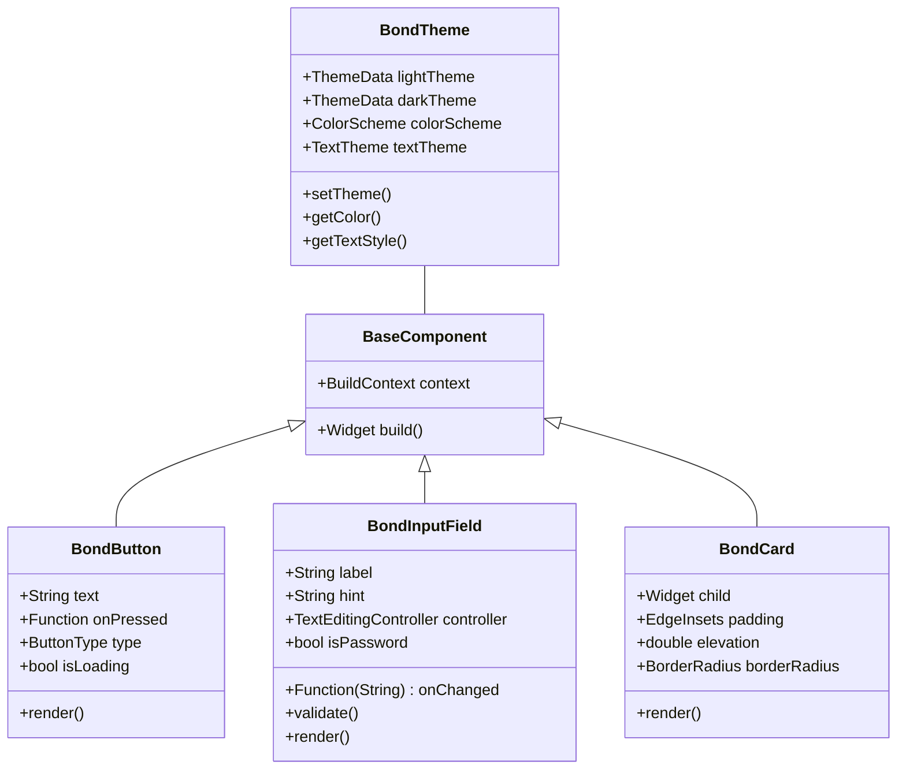
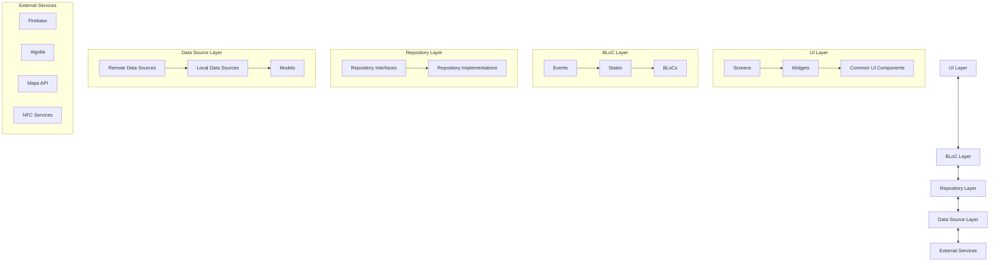

# Bond App - Frontend Guidelines

## 1. Introduction

This document outlines the frontend development guidelines for the Bond social meeting application. It serves as a reference for ensuring consistent code quality, design implementation, and development practices across the Flutter-based frontend codebase.

## 2. Design System

### 2.1 Brand Identity

- **Primary Color**: `#3B82F6` (Blue-500)
- **Secondary Color**: `#10B981` (Green-500)
- **Accent Color**: `#8B5CF6` (Purple-500)
- **Error Color**: `#EF4444` (Red-500)
- **Warning Color**: `#F59E0B` (Amber-500)
- **Success Color**: `#10B981` (Green-500)
- **Text Colors**:
  - Primary: `#111827` (Gray-900)
  - Secondary: `#4B5563` (Gray-600)
  - Tertiary: `#9CA3AF` (Gray-400)
- **Background Colors**:
  - Primary: `#F9FAFB` (Gray-50)
  - Secondary: `#FFFFFF` (White)
  - Tertiary: `#F3F4F6` (Gray-100)

### 2.2 Typography

- **Font Family**: SF Pro Display (iOS), Roboto (Android)
- **Text Styles**:
  - Headline 1: 32px, Bold, 1.2 line height
  - Headline 2: 24px, Bold, 1.2 line height
  - Title 1: 20px, Bold, 1.3 line height
  - Title 2: 18px, Bold, 1.3 line height
  - Body 1: 16px, Regular, 1.5 line height
  - Body 2: 14px, Regular, 1.5 line height
  - Caption: 12px, Regular, 1.4 line height
  - Button Text: 16px, Medium, 1.25 line height

### 2.3 Component Library

All UI components should be built using our custom component library built on top of Flutter's Material Design components. The library includes:

- **Buttons**:
  - Primary Button
  - Secondary Button
  - Text Button
  - Icon Button
  - Rounded Button
- **Input Fields**:
  - Text Input
  - Dropdown
  - Search Input
  - Date/Time Picker
- **Cards**:
  - Profile Card
  - Meeting Card
  - Interest Card
  - Compatibility Card
- **Dialogs and Modals**:
  - Alert Dialog
  - Confirmation Dialog
  - Bottom Sheet
  - Modal Popup
- **Navigation**:
  - Bottom Navigation Bar
  - Tabs
  - App Bar
- **Indicators**:
  - Progress Bar
  - Availability Indicator
  - Compatibility Score Indicator
  - Token Balance Indicator
- **Lists and Grids**:
  - User List
  - Interest Grid
  - Availability Timeline
  - Meeting History List



### 2.4 Iconography

- Use Lucide React icons throughout the application
- Maintain consistent icon sizing across similar contexts:
  - Navigation: 24px
  - Action buttons: 20px
  - Indicators: 16px
  - Informational: 14px
- All icons should have a touch target of at least 44x44px
- Use appropriate semantic colors for icons based on their context

### 2.5 Animations and Transitions

- Standard page transitions: horizontal slide for nested navigation, fade for tab changes
- Subtle micro-interactions for user feedback (button presses, state changes)
- Loading states: Skeleton loaders for content, circular progress for actions
- Use `AnimationController` and `Tween` for custom animations
- Keep animations under 300ms for responsiveness
- Ensure animations respect user accessibility settings for reduced motion

## 3. Code Structure

### 3.1 Architecture Pattern

The Bond app follows a layered architecture based on the BLoC (Business Logic Component) pattern:



### 3.2 Folder Structure

```
lib/
├── app/
│   ├── app.dart
│   ├── router.dart
│   └── theme.dart
├── blocs/
│   ├── auth/
│   ├── profile/
│   ├── connection/
│   ├── meeting/
│   ├── message/
│   ├── discovery/
│   └── token/
├── data/
│   ├── models/
│   ├── repositories/
│   └── sources/
├── screens/
│   ├── auth/
│   ├── home/
│   ├── profile/
│   ├── discovery/
│   ├── connection/
│   ├── meeting/
│   ├── message/
│   └── donation/
├── widgets/
│   ├── common/
│   ├── profile/
│   ├── map/
│   ├── connection/
│   ├── meeting/
│   └── message/
├── utils/
│   ├── constants.dart
│   ├── extensions.dart
│   ├── formatters.dart
│   ├── validators.dart
│   └── helpers.dart
├── services/
│   ├── firebase_service.dart
│   ├── algolia_service.dart
│   ├── location_service.dart
│   ├── nfc_service.dart
│   └── analytics_service.dart
└── main.dart
```

### 3.3 State Management

- Use Flutter BLoC pattern for state management
- Define clear events, states, and BLoCs for each feature
- Utilize StreamBuilder and BlocBuilder for reactive UI updates
- Keep BLoCs focused on single responsibilities
- Ensure proper disposal of streams and controllers

### 3.4 Dependency Injection

- Use `get_it` package for service locator pattern
- Register all repositories, services, and BLoCs at app initialization
- Inject dependencies via constructors for better testability
- Utilize factory patterns for complex object creation
- Maintain a centralized dependency registration module

## 4. Coding Standards

### 4.1 General Guidelines

- Follow Dart's official style guide
- Use meaningful, descriptive names for variables, functions, and classes
- Keep functions and methods small and focused on a single responsibility
- Use early returns to reduce nesting
- Avoid code duplication through abstraction and reusable components
- Use const constructors wherever possible for performance
- Write self-documenting code with appropriate comments for complex logic

### 4.2 Flutter-Specific Guidelines

- Prefer StatelessWidget over StatefulWidget when possible
- Extract reusable widgets to separate files
- Use keys for stateful widgets that need to maintain state across rebuilds
- Optimize builds by using const constructors and memoization
- Use SizedBox instead of Container when only size constraints are needed
- Prefer CustomPainter for complex custom UI instead of nested Container widgets
- Avoid using MediaQuery in deeply nested widgets

### 4.3 Performance Optimization

- Use const constructors to prevent unnecessary rebuilds
- Implement pagination for lists with potentially large datasets
- Optimize image loading with caching and appropriate resolutions
- Use efficient data structures and algorithms for complex operations
- Minimize expensive operations in the build method
- Utilize compute function for CPU-intensive tasks
- Profile and optimize render times for critical UI components

### 4.4 Error Handling

- Implement comprehensive error handling throughout the app
- Use try-catch blocks for code that might throw exceptions
- Display user-friendly error messages for common error cases
- Log errors with relevant context information
- Provide recovery options when possible
- Handle network connectivity issues gracefully
- Implement fallback states for failed data fetching

## 5. Testing Strategy

### 5.1 Unit Testing

- Write unit tests for all BLoCs, repositories, and utility functions
- Mock dependencies using `mockito` or `mocktail`
- Test both success and failure cases
- Achieve minimum 80% code coverage for business logic
- Use parameterized tests for functions with multiple input scenarios
- Follow the Arrange-Act-Assert pattern for test structure

### 5.2 Widget Testing

- Test key UI components in isolation
- Verify widget rendering for different states
- Test user interactions and resulting state changes
- Use `WidgetTester` for simulating user actions
- Test accessibility features like screen reader support
- Verify widget behavior across different screen sizes

### 5.3 Integration Testing

- Test complete user flows from end to end
- Verify integration between different components
- Test Firebase service integration with mock services
- Validate navigation and state persistence
- Test offline functionality and data synchronization
- Verify proper handling of system permissions

### 5.4 Performance Testing

- Measure and track app startup time
- Test scrolling performance with large datasets
- Profile memory usage during extended sessions
- Verify animation smoothness on lower-end devices
- Test battery consumption for location tracking features
- Ensure widget rebuild optimization

## 6. Responsive Design

### 6.1 Device Support

- Support various screen sizes from small phones to tablets
- Implement adaptive layouts using LayoutBuilder and MediaQuery
- Use flexible widgets (Expanded, Flexible) for adaptive sizing
- Test on representative device sizes (small phone, standard phone, large phone, tablet)
- Handle notches, cutouts, and safe areas appropriately

### 6.2 Orientation Support

- Support both portrait and landscape orientations for key screens
- Optimize layout for orientation changes
- Use OrientationBuilder where appropriate
- Consider different UI arrangements for landscape mode on smaller devices
- Maintain consistent user experience across orientations

### 6.3 Accessibility

- Support dynamic text sizing
- Maintain minimum touch target sizes (48×48dp)
- Implement proper semantic labels for screen readers
- Ensure sufficient color contrast (WCAG AA compliance)
- Support system dark mode
- Provide alternatives for color-based information
- Respect system-level accessibility settings

## 7. Asset Management

### 7.1 Images and Icons

- Use SVG for icons when possible
- Provide appropriate resolution images (1x, 2x, 3x)
- Optimize image file sizes
- Use appropriate image formats (PNG for transparency, JPEG for photos)
- Lazy load images that are not immediately visible
- Implement placeholder and error states for image loading

### 7.2 Fonts

- Use system fonts when possible for performance
- Limit custom font weights to necessary variants
- Include fallback fonts for unsupported systems
- Ensure proper licensing for all custom fonts
- Optimize font file sizes

### 7.3 Localization

- Use Flutter's intl package for localization
- Extract all user-facing strings to ARB files
- Support right-to-left (RTL) layouts for appropriate languages
- Format dates, times, and numbers according to locale
- Test with pseudo-localization to catch hard-coded strings

## 8. Documentation

### 8.1 Code Documentation

- Document all public API methods and classes
- Use dartdoc comments for classes and public methods
- Document complex algorithms and business logic
- Include usage examples for reusable components
- Keep documentation updated as code changes

### 8.2 UI Component Documentation

- Maintain a living style guide of UI components
- Document component variants and states
- Include usage guidelines and examples
- Document props and customization options
- Provide accessibility considerations

### 8.3 Architecture Documentation

- Maintain up-to-date architecture diagrams
- Document key design decisions and trade-offs
- Provide context for architectural patterns used
- Document integration with external services
- Include data flow diagrams for complex features

## 9. Third-Party Packages

### 9.1 Approved Packages

The following packages are approved for use in the Bond app:

- **State Management**: flutter_bloc, provider
- **Navigation**: go_router, auto_route
- **Networking**: dio, http
- **Local Storage**: shared_preferences, hive
- **Firebase**: firebase_core, firebase_auth, cloud_firestore, firebase_storage
- **Analytics**: firebase_analytics, mixpanel_flutter
- **UI Utilities**: flutter_svg, cached_network_image, shimmer
- **Forms**: reactive_forms, form_field_validator
- **Maps**: google_maps_flutter, location
- **Utilities**: intl, uuid, equatable, json_serializable

### 9.2 Package Guidelines

- Evaluate packages for maintenance status and community support
- Check license compatibility before adding new packages
- Consider package size and impact on app bundle size
- Prefer official Flutter team packages when available
- Wrap third-party packages in service classes for easier replacement
- Document usage of and dependencies on third-party packages

## 10. Version Control

### 10.1 Git Workflow

- Use GitHub Flow (feature branches + main branch)
- Create feature branches from main
- Use descriptive branch names prefixed with type (feature/, bugfix/, hotfix/)
- Submit PRs for code review before merging
- Squash commits when merging to maintain clean history
- Tag releases with semantic versioning

### 10.2 Commit Guidelines

- Write descriptive commit messages
- Use present tense ("Add feature" not "Added feature")
- Reference issue numbers in commit messages
- Keep commits focused on single changes
- Separate formatting changes from functional changes

### 10.3 Code Review

- Use pull requests for all changes
- Require at least one approval before merging
- Review for code quality, performance, and adherence to guidelines
- Use automated checks for linting and tests
- Provide constructive feedback with solutions
- Verify UI changes with screenshots or recordings

## 11. CI/CD

### 11.1 Continuous Integration

- Run automated tests on each PR
- Verify code style and formatting
- Check for dependency conflicts
- Analyze code for potential issues
- Build debug versions to verify compilation

### 11.2 Continuous Delivery

- Automate build process for both Android and iOS
- Generate build numbers based on commits
- Tag successful builds with version info
- Deploy to test environments automatically
- Generate changelogs from commit messages

### 11.3 Environment Management

- Maintain separate environments (development, staging, production)
- Use Firebase project environments per stage
- Configure feature flags for staged rollouts
- Implement different app icons per environment
- Use environment-specific API endpoints and config

## 12. Performance Monitoring

- Implement Firebase Performance Monitoring
- Track key user flows and screen load times
- Monitor network request performance
- Set up alerts for performance regressions
- Track memory and CPU usage
- Analyze startup time and optimization opportunities
- Monitor battery impact of location features

By following these frontend guidelines, we will ensure a consistent, high-quality, and maintainable codebase for the Bond app.
