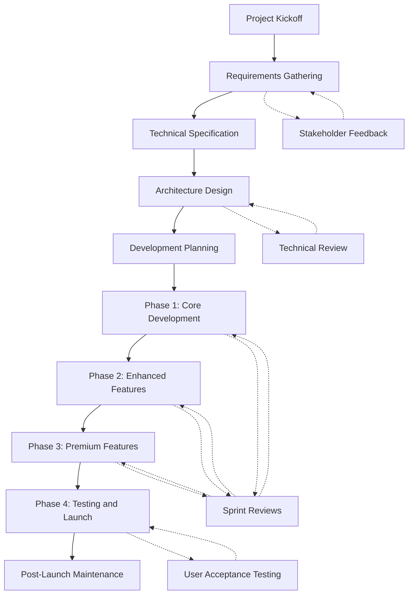

# Bond App - Project Requirements Document

## 1. Project Overview

Bond is a social meeting application designed to help users connect with people nearby based on compatibility, shared interests, and real-time availability. The app promotes real-world connections by facilitating in-person meetings, verified through NFC technology, and rewarding users with Bond Tokens.

## 2. Business Requirements

### 2.1 Core Business Goals

1. Create a platform that enables meaningful in-person connections based on compatibility
2. Implement a gamified system (Bond Tokens) to encourage and reward real-world meetings
3. Generate revenue through a multi-tiered donor subscription model
4. Provide a seamless, intuitive user experience that promotes regular engagement
5. Build a scalable infrastructure to support growth across multiple geographic regions

### 2.2 Target Audience

- Primary: Urban professionals aged 25-40 seeking to expand their social circles
- Secondary: New residents in cities looking to establish connections
- Tertiary: Interest-based communities (sports enthusiasts, tech professionals, etc.)

### 2.3 Unique Value Propositions

1. **Compatibility-Based Matching**: Advanced algorithm to determine compatibility beyond basic interests
2. **Real-Time Availability**: Shows who is available to meet right now or in the near future
3. **NFC Verification**: Unique technology to verify in-person meetings have occurred
4. **Token Economy**: Gamified system that rewards real-world connections
5. **Donor Model**: Non-intrusive monetization with value-adding premium features

## 3. Functional Requirements

### 3.1 User Management

- User registration and authentication
- Social login integration (Google, Apple, Facebook)
- Comprehensive user profiles with interests, availability, and location
- Profile editing and management
- Availability status setting (available now, available later, unavailable)
- User statistics (connections, meetings, ratings)

### 3.2 Discovery & Connections

- Location-based user discovery with map and list views
- Advanced filtering by compatibility, interests, and availability
- Detailed user profiles with compatibility scores
- Connection request system with accept/decline functionality
- Connection management interface

### 3.3 Meeting Coordination

- In-app meeting scheduling and coordination
- Activity type, location, and time slot selection
- Meeting request system with notifications
- Calendar integration for scheduled meetings
- Meeting history tracking
- NFC-based meeting verification

### 3.4 Messaging

- Real-time messaging between connected users
- Meeting suggestion through messaging
- Notifications for new messages
- Read receipts
- Suggested meeting cards in messages

### 3.5 Token Economy

- Token acquisition through verified meetings and other activities
- Token balance display and transaction history
- Token usage for premium features
- Donor tiers with benefits including increased token earning

### 3.6 Donor Management

- Multiple subscription tiers (Silver, Gold, Platinum)
- Subscription management and payment processing
- Donor badge display on profiles
- Donor-specific benefits and features
- Subscription upgrade/downgrade options

## 4. Non-Functional Requirements

### 4.1 Performance

- App launch time under 2 seconds on mid-range devices
- Map view loading and rendering in under 3 seconds
- Message delivery latency under 500ms
- Profile data synchronization within 2 seconds
- Meeting verification processing under 5 seconds
- 99.9% uptime for core functions

### 4.2 Security

- Secure authentication and authorization system
- End-to-end encryption for messages
- Privacy controls for user location data
- Secure payment processing for subscriptions
- Data encryption at rest and in transit
- GDPR and CCPA compliance
- Regular security audits and penetration testing

### 4.3 Scalability

- Support for 100,000+ concurrent users
- Efficient database schema to handle millions of records
- Geographic distribution capability for global expansion
- Ability to handle 10,000+ meeting verifications per hour during peak times
- Optimized queries for location-based searches across large datasets

### 4.4 Compatibility

- iOS 14.0+ support
- Android 9.0+ support
- Optimal performance on devices released in the last 4 years
- Responsive design for various screen sizes
- Localization support for multiple languages

### 4.5 Reliability

- Offline functionality for core features
- Automatic retry mechanisms for failed operations
- Data backup and recovery protocols
- Graceful error handling and user feedback
- Crash reporting and analytics

## 5. Technical Requirements

### 5.1 Frontend (Flutter)

- Cross-platform Flutter framework (latest stable version)
- Material Design 3 and custom UI component library
- State management using Provider or Bloc pattern
- Location and map services integration
- NFC capabilities for meeting verification
- Push notification integration
- Offline data caching
- Responsive layouts for all device sizes
- Comprehensive test coverage

### 5.2 Backend (Firebase)

- Firebase Authentication for user management
- Cloud Firestore for real-time data storage
- Firebase Cloud Functions for serverless operations
- Firebase Cloud Messaging for notifications
- Firebase Storage for media content
- Firebase Analytics for user behavior tracking
- Firebase Crashlytics for error monitoring
- Firebase App Check for security

### 5.3 Search (Algolia)

- Algolia for high-performance search capabilities
- Geo-based search functionality
- Faceted search for interest and availability filtering
- Typo-tolerant search for user discovery
- Real-time indexing of user data
- Custom ranking algorithms for compatibility

### 5.4 Third-Party Integrations

- Google Maps API for location services
- Payment processing (Stripe)
- Calendar integration (Google Calendar, Apple Calendar)
- Social login providers (Google, Apple, Facebook)
- Analytics services (Firebase Analytics, Mixpanel)

## 6. Project Timeline

### 6.1 Phase 1: Core Development (3 months)

- User authentication and profile management
- Basic discovery and connection functionality
- Simplified messaging system
- Location services and map views
- Basic UI/UX implementation

### 6.2 Phase 2: Enhanced Features (2 months)

- Advanced compatibility algorithm
- Complete messaging system
- Meeting scheduling and coordination
- Token economy implementation
- Payment processing integration

### 6.3 Phase 3: Premium Features (2 months)

- NFC meeting verification
- Donor subscription model
- Advanced filters and search capabilities
- Analytics and reporting
- Performance optimization

### 6.4 Phase 4: Testing and Launch (1 month)

- Comprehensive testing (unit, integration, UAT)
- Bug fixing and performance tuning
- App store submission and approval
- Soft launch and feedback collection
- Marketing and full launch

## 7. Success Criteria

### 7.1 User Engagement

- 60%+ retention rate after 30 days
- Average of 5+ app sessions per week per active user
- 40%+ of connections leading to scheduled meetings
- 75%+ of scheduled meetings being completed and verified
- 25%+ of users active daily

### 7.2 Business Metrics

- 15%+ of active users converting to donors
- Average revenue per user (ARPU) of $3.50+
- Customer acquisition cost (CAC) below $10
- 90-day donor retention rate of 70%+
- Net promoter score (NPS) of 40+

## 8. Constraints and Assumptions

### 8.1 Constraints

- Budget limitations for third-party services
- Technical limitations of NFC technology across different devices
- Privacy regulations affecting location data collection and usage
- App store policies for subscription-based models
- Cross-platform development limitations in Flutter

### 8.2 Assumptions

- Target users have smartphones with NFC capabilities
- Users are willing to share location data for improved matching
- The token economy will drive desired user behaviors
- The compatibility algorithm can effectively predict successful connections
- User adoption will be sufficient to create network effects in launch cities

## 9. Risks and Mitigation Strategies

### 9.1 Technical Risks

| Risk | Impact | Probability | Mitigation Strategy |
|------|--------|------------|---------------------|
| NFC compatibility issues across devices | High | Medium | Comprehensive device testing, alternative verification methods |
| Performance issues with location-based queries | High | Medium | Optimization of queries, caching strategies, Algolia implementation |
| Real-time communication failures | Medium | Low | Robust offline support, retry mechanisms, graceful degradation |
| Security vulnerabilities | High | Low | Regular security audits, penetration testing, Firebase App Check |
| Data synchronization issues | Medium | Medium | Conflict resolution strategies, versioning, backup mechanisms |

### 9.2 Business Risks

| Risk | Impact | Probability | Mitigation Strategy |
|------|--------|------------|---------------------|
| Low user adoption | High | Medium | Strategic marketing, referral programs, targeted launch cities |
| Poor conversion to donors | High | Medium | Value-driven premium features, A/B testing of offers |
| Negative user experiences | High | Low | Comprehensive user testing, feedback loops, gradual feature rollout |
| Regulatory challenges | Medium | Medium | Compliance-focused design, legal consultation, privacy by design |
| Competitor emergence | Medium | High | Rapid iteration, unique feature focus, strong community building |

## 10. Dependencies

- Flutter SDK and Dart language ecosystem
- Firebase services availability and pricing
- Algolia search service availability and pricing
- NFC hardware support across target devices
- Third-party API availability and rate limits
- App store review and approval timelines

## 11. Approval and Sign-off

This requirements document is subject to review and approval by:

- Product Owner
- Technical Lead
- UI/UX Lead
- Quality Assurance Lead
- Security Officer

Once approved, this document will serve as the baseline for project development and will be subject to change control procedures.

