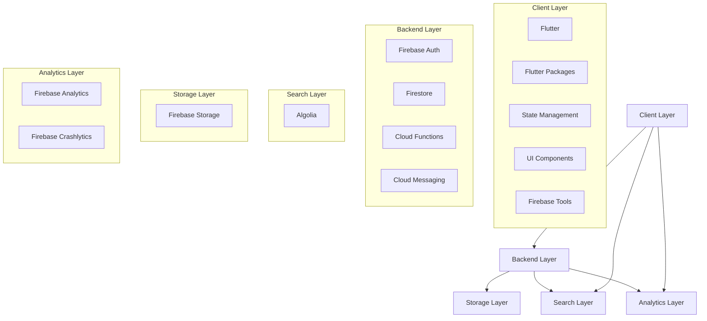
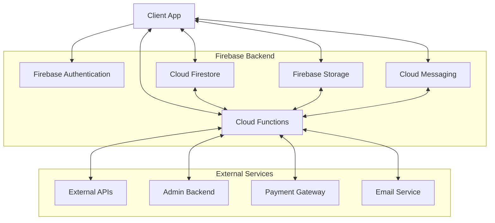
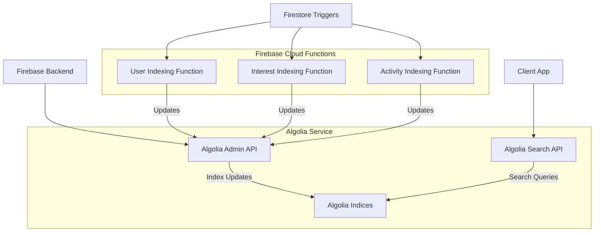

# Bond App - Tech Stack Document

## 1. Introduction

This document outlines the technology stack for the Bond social meeting application. The tech stack has been carefully selected to ensure scalability, reliability, maintainability, and rapid development while keeping costs manageable. The core technologies include Flutter for cross-platform mobile development, Firebase for backend services, and Algolia for search functionality.

## 2. Tech Stack Overview



## 3. Frontend Technology Stack

### 3.1 Core Framework

- **Flutter (latest stable version)**
  - Cross-platform development framework
  - Single codebase for iOS and Android
  - Native performance
  - Rich widget library
  - Hot reload for rapid development

### 3.2 State Management

- **Flutter Bloc**
  - Predictable state management
  - Clear separation of UI and business logic
  - Reactive programming with streams
  - Testable components
  - Event-driven architecture

### 3.3 UI Components

- **Material Components**
  - Material Design 3 implementation
  - Consistent UI elements
  - Responsive layouts
  - Accessibility support

- **Custom Component Library**
  - Bond-specific UI components
  - Consistent styling across the app
  - Reusable patterns
  - Theme-aware components

### 3.4 Frontend Packages

#### Core Utilities
- **dio**: HTTP client for API requests
- **get_it**: Service locator for dependency injection
- **shared_preferences**: Local storage for user preferences
- **hive**: NoSQL database for local data persistence
- **intl**: Internationalization and localization
- **path_provider**: File system access
- **url_launcher**: Opening URLs in browser/apps

#### UI Enhancements
- **flutter_svg**: SVG rendering
- **cached_network_image**: Image caching
- **shimmer**: Loading effect for placeholders
- **lottie**: Animation rendering
- **flutter_markdown**: Markdown rendering
- **photo_view**: Image zoom and pan
- **flutter_slidable**: Swipeable list items

#### Maps and Location
- **google_maps_flutter**: Maps integration
- **geolocator**: Location services
- **geocoding**: Address lookup
- **flutter_polyline_points**: Route drawing

#### Firebase Integration
- **firebase_core**: Firebase core functionality
- **firebase_auth**: Authentication services
- **cloud_firestore**: NoSQL database
- **firebase_storage**: File storage
- **firebase_messaging**: Push notifications
- **firebase_analytics**: User analytics
- **firebase_crashlytics**: Crash reporting
- **firebase_remote_config**: Feature flags and remote configuration

#### NFC and Device Features
- **nfc_manager**: NFC tag reading and writing
- **flutter_nfc_kit**: Cross-platform NFC operations
- **local_auth**: Biometric authentication
- **device_info_plus**: Device information
- **connectivity_plus**: Network connectivity monitoring
- **flutter_app_badger**: Application badge management

#### Search Integration
- **algolia**: Algolia search client

## 4. Backend Technology Stack

### 4.1 Firebase Services

- **Firebase Authentication**
  - User authentication and management
  - Multiple sign-in methods (email/password, Google, Apple, Facebook)
  - User session management
  - Security rules integration

- **Cloud Firestore**
  - NoSQL document database
  - Real-time data synchronization
  - Offline data persistence
  - Scalable data model
  - Complex query support
  - Security rules for access control

- **Firebase Cloud Functions**
  - Serverless backend functions
  - Event-driven architecture
  - Integration with other Firebase services
  - Background processing
  - Scheduled tasks
  - API endpoints

- **Firebase Cloud Messaging**
  - Push notification delivery
  - Targeted messaging
  - Notification templates
  - Scheduled notifications
  - Analytics integration

- **Firebase Storage**
  - File storage for user-generated content
  - Security rules for access control
  - Content delivery
  - Metadata support
  - Image resizing and optimization

### 4.2 Backend Architecture



### 4.3 Firebase Configuration

- **Development Environment**
  - Separate Firebase project
  - Development-specific configuration
  - Test data
  - Relaxed security rules

- **Staging Environment**
  - Separate Firebase project
  - Production-like configuration
  - Sample production data
  - Strict security rules

- **Production Environment**
  - Primary Firebase project
  - Production configuration
  - Real user data
  - Strict security rules
  - Monitoring and alerts

### 4.4 Security Rules

- **Authentication Rules**
  - User authentication requirements
  - Session management
  - Token refresh policies

- **Firestore Rules**
  - Document-level access control
  - Field-level security
  - Query limitations
  - Validation rules

- **Storage Rules**
  - File access permissions
  - Upload size limits
  - File type restrictions
  - Metadata validation

## 5. Search Technology Stack

### 5.1 Algolia Implementation

- **Core Features**
  - Fast and scalable search
  - Typo-tolerant search
  - Geo-based search
  - Faceted search
  - Custom ranking

- **Integration Points**
  - User discovery
  - Interest-based search
  - Location-based matching
  - Activity search

- **Algolia Architecture**



### 5.2 Algolia Indices

- **User Index**
  - User profiles for discovery
  - Searchable by interests, availability, location
  - Filterable by compatibility, donor status, activity level

- **Interest Index**
  - Interest categories and subcategories
  - Related activities
  - Popular combinations

- **Activity Index**
  - Meeting activities
  - Venues and locations
  - Time-based popularity

### 5.3 Sync Strategy

- **Real-time Updates**
  - Cloud Functions triggered by Firestore changes
  - Batched updates for efficiency
  - Partial updates for large documents

- **Scheduled Reindexing**
  - Nightly full reindexing
  - Consistency validation
  - Data cleanup

## 6. Analytics and Monitoring Stack

### 6.1 Firebase Analytics

- **User Analytics**
  - User demographics
  - User behavior
  - Conversion tracking
  - Funnel analysis
  - Retention measurement

- **Custom Events**
  - Connection events
  - Meeting events
  - Token transactions
  - Feature usage

- **Conversion Tracking**
  - Registration completion
  - First connection
  - First meeting
  - Donor conversion

### 6.2 Firebase Crashlytics

- **Crash Reporting**
  - Automatic crash detection
  - Symbolicated stack traces
  - User impact measurement
  - Issue prioritization

- **Performance Monitoring**
  - App startup time
  - Screen render time
  - Network request latency
  - Battery usage

### 6.3 Firebase Performance Monitoring

- **Network Monitoring**
  - API call performance
  - Success rates
  - Timeout rates
  - Payload sizes

- **Render Performance**
  - UI rendering metrics
  - Scroll performance
  - Animation smoothness
  - Memory usage

## 7. Development Tools and Environment

### 7.1 Development Environment

- **Flutter Development**
  - Android Studio / VS Code
  - Flutter SDK
  - Dart SDK
  - Flutter DevTools
  - Flutter Inspector

- **Firebase Tools**
  - Firebase CLI
  - Firebase Console
  - Firebase Emulator Suite
  - Firebase App Distribution

- **Algolia Tools**
  - Algolia Dashboard
  - Algolia CLI
  - InstantSearch tools

### 7.2 CI/CD Pipeline

```mermaid
flowchart TD
    A[Code Pushed to GitHub] --> B[GitHub Actions]
    B --> C{Branch?}
    C -->|feature| D[Run Tests]
    C -->|develop| E[Run Tests & Build Dev]
    C -->|staging| F[Run Tests & Build Staging]
    C -->|main| G[Run Tests & Build Production]
    
    D -->|Success| H[PR Review]
    E -->|Success| I[Deploy to Dev]
    F -->|Success| J[Deploy to Staging]
    G -->|Success| K[Deploy to Production]
    
    I --> L[Dev Testing]
    J --> M[QA Testing]
    K --> N[Release]
    
    L -->|Issues| O[Fix in Dev]
    M -->|Issues| P[Fix in Staging]
    N -->|