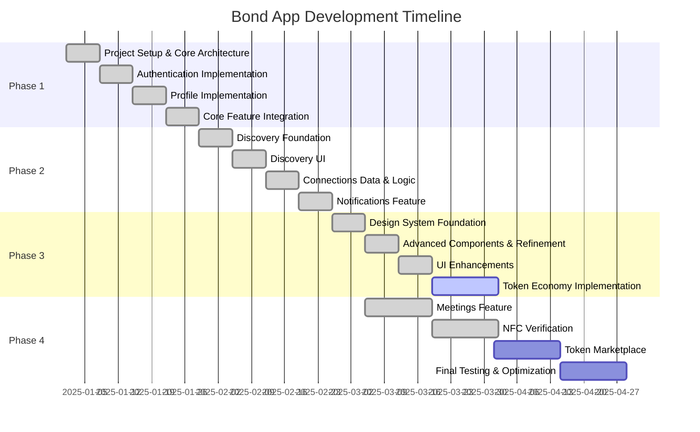
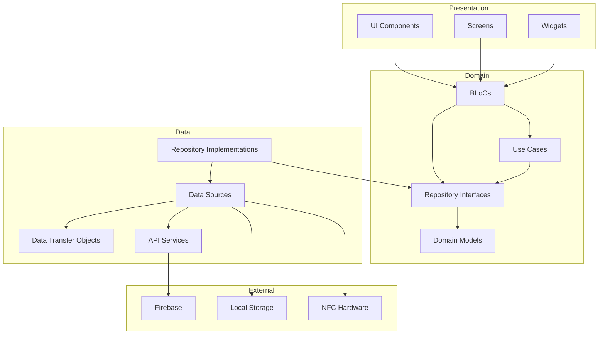
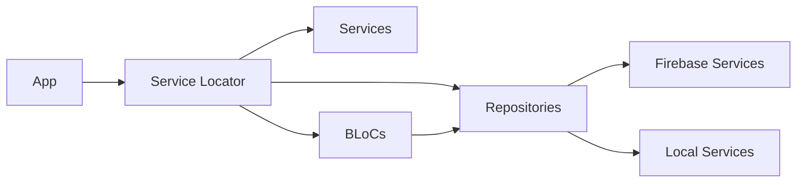
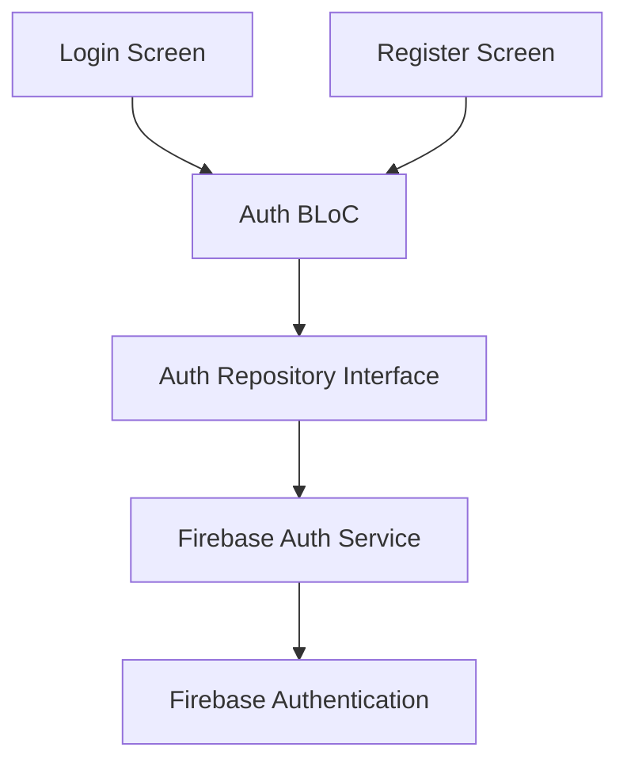
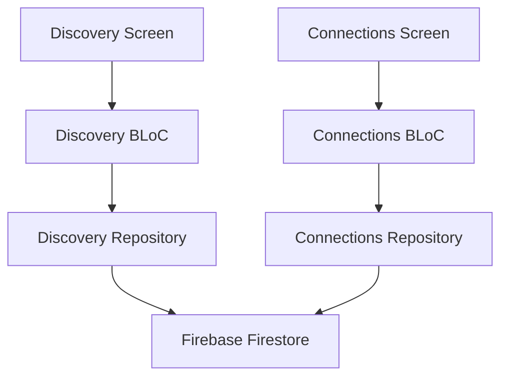
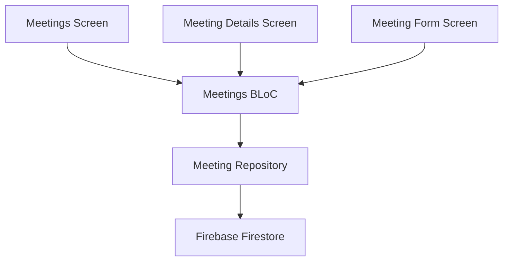
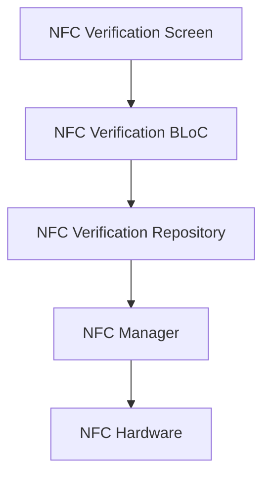
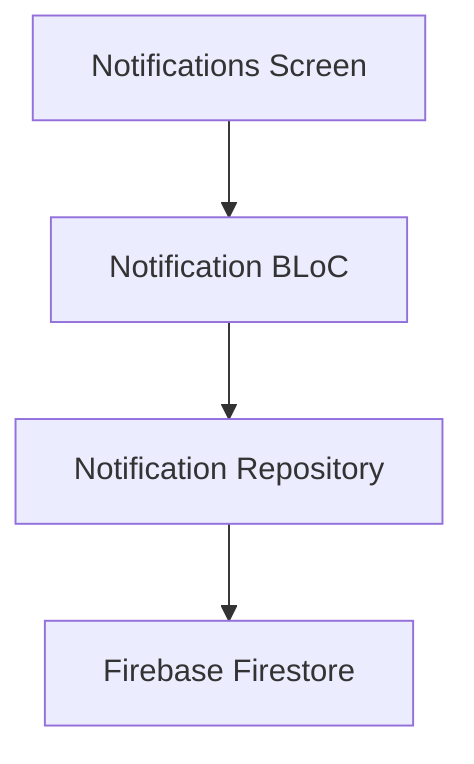
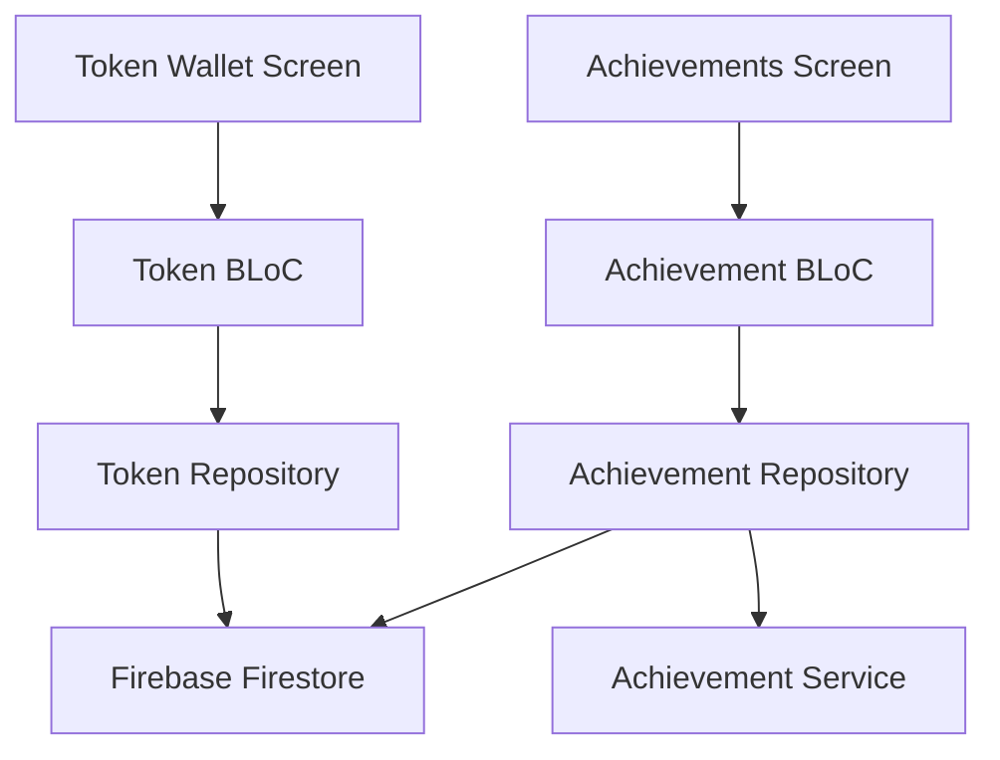

# Bond App Project Handoff Document

## Project Overview

The Bond App is a social connection platform built with Flutter and Firebase, designed to help users create and maintain meaningful connections through in-person meetings and digital interactions. This document provides a comprehensive overview of the project's journey, challenges, solutions, and future directions.

## Table of Contents

1. [Project Timeline](#project-timeline)
2. [Architecture Overview](#architecture-overview)
3. [Feature Implementation](#feature-implementation)
4. [Technical Challenges & Solutions](#technical-challenges--solutions)
5. [Pivots & Strategic Changes](#pivots--strategic-changes)
6. [Current Status](#current-status)
7. [Remaining Tasks](#remaining-tasks)
8. [Future Challenges](#future-challenges)
9. [Handoff Instructions](#handoff-instructions)

## Project Timeline



## Architecture Overview

The Bond App follows a clean architecture approach with clear separation of concerns:



### Dependency Injection

We use the `get_it` package for dependency injection, allowing for clean separation of concerns and easier testing:



## Feature Implementation

### Authentication System

Initially implemented with a mock authentication service for rapid development, then migrated to Firebase Authentication for production use.



**Key Achievements:**
- Secure user authentication with email/password
- User registration with validation
- Password reset functionality
- Session management
- Secure token storage

### Design System

Implemented a comprehensive design system with reusable components following the Neo-Glassmorphism design language.

**Core Components:**
- BondButton: Multiple variants, loading state, haptic feedback
- BondCard: Glass effect, customizable borders, variant support
- BondAvatar: Multiple sizes, status indicators
- BondInput: Multiple variants, validation support
- BondBadge: Multiple variants and sizes
- BondToggle: Smooth animations, haptic feedback
- BondChip: Multiple variants, selectable/deletable states
- BondBottomSheet: Glass effect, drag handle
- BondDialog: Multiple dialog types, glass effect

**Advanced Components:**
- BondList and BondListItem: Multiple variants, section headers
- BondTabBar: Multiple variants, icons and badges
- BondSegmentedControl: Multiple variants, customizable segments
- BondProgressIndicator: Multiple variants (circular, linear, stepped)
- BondToast: Multiple variants (info, success, warning, error)
- BondBackground: Consistent background treatments
- BondEmptyState: Empty state handling

### Connections Feature

Implemented a comprehensive connections system allowing users to discover, connect, and interact with other users.



**Key Achievements:**
- User discovery with filtering and sorting
- Connection requests and management
- Real-time connection status updates
- Connection profiles and details

### Meetings Feature

Implemented a meetings system for scheduling and managing in-person connections.



**Key Achievements:**
- Meeting creation and scheduling
- Meeting details and management
- Attendee management
- Meeting status tracking

### NFC Verification

Implemented NFC verification for in-person meeting authentication.



**Key Achievements:**
- Secure NFC verification with SHA-256 hashing
- iOS and Android compatibility
- Graceful degradation when NFC is unavailable
- Integration with meetings feature

### Notifications Feature

Implemented a comprehensive notification system for app events.



**Key Achievements:**
- Multiple notification types
- Notification grouping by date
- Mark as read/unread functionality
- Notification deletion

### Token Economy

Implemented a token economy system to incentivize user engagement.



**Key Achievements:**
- Token balance management
- Transaction history
- Achievement system
- Token earning mechanisms
- Token wallet UI
- Achievements UI

## Technical Challenges & Solutions

### Challenge 1: iOS Build Issues with Firebase

**Problem:** Initial integration of Firebase SDK caused iOS build failures due to compatibility issues.

**Solution:** 
- Implemented a REST-based approach for Firebase interactions instead of using the full SDK
- Gradually migrated to the Firebase SDK with careful testing at each step
- Created a comprehensive testing strategy for iOS builds

### Challenge 2: State Management Complexity

**Problem:** Managing complex state across multiple features proved challenging.

**Solution:**
- Adopted the BLoC pattern consistently across all features
- Implemented clear event and state hierarchies
- Used freezed for immutable state classes
- Created a standardized approach to error handling

### Challenge 3: NFC Implementation on iOS

**Problem:** iOS has strict limitations on NFC usage compared to Android.

**Solution:**
- Implemented a platform-specific approach for NFC handling
- Created a fallback mechanism for devices without NFC
- Added comprehensive documentation for iOS NFC configuration
- Used SHA-256 hashing for secure verification payloads

### Challenge 4: Performance Optimization

**Problem:** Initial implementation had performance issues with large data sets.

**Solution:**
- Implemented pagination for list views
- Added caching mechanisms for frequently accessed data
- Optimized Firebase queries with proper indexing
- Reduced unnecessary rebuilds in the UI

## Pivots & Strategic Changes

### Pivot 1: Authentication Strategy

**Initial Approach:** Started with a custom authentication system using REST APIs.

**Pivot:** Migrated to Firebase Authentication for better security and reliability.

**Reasoning:** Firebase Authentication provided a more robust solution with less maintenance overhead and better security features.

### Pivot 2: Design Language

**Initial Approach:** Standard Material Design components.

**Pivot:** Custom Neo-Glassmorphism design system with Bento Box layouts.

**Reasoning:** Created a more distinctive and modern UI that better aligned with the brand identity and provided a more engaging user experience.

### Pivot 3: Token Economy

**Initial Approach:** Basic gamification elements.

**Pivot:** Comprehensive token economy with achievements and marketplace.

**Reasoning:** Enhanced user engagement and retention through meaningful rewards and progression systems.

## Current Status

The Bond App is currently in the final stages of development with most core features implemented and functional:

### Completed Features
- Authentication System
- User Profiles
- Connections Management
- Meetings Feature
- NFC Verification
- Notifications System
- Design System
- Token Economy (core functionality)

### In Progress
- Token Economy (marketplace)
- Advanced Achievement System
- UI Refinements
- Performance Optimization

## Remaining Tasks

1. **Token Marketplace Implementation**
   - Create marketplace UI
   - Implement token spending mechanisms
   - Add virtual goods and services

2. **Advanced Achievement System**
   - Implement multi-tier achievements
   - Add social sharing for achievements
   - Create leaderboards

3. **Performance Optimization**
   - Optimize Firebase queries
   - Implement advanced caching
   - Reduce rebuild frequency

4. **Testing & Quality Assurance**
   - Complete unit test coverage
   - Conduct integration testing
   - Perform UI/UX testing
   - Test on multiple devices

5. **Documentation**
   - Complete API documentation
   - Create user guides
   - Prepare deployment documentation

## Future Challenges

1. **Scaling**
   - As the user base grows, optimizing Firebase costs and performance will be crucial
   - Consider implementing server-side caching or a custom backend for high-traffic operations

2. **iOS App Store Approval**
   - NFC usage on iOS requires careful documentation and justification
   - Prepare detailed explanations for App Store review

3. **User Retention**
   - Continuously evolve the token economy to maintain engagement
   - Implement analytics to identify drop-off points

4. **Feature Expansion**
   - Group meetings and events
   - Advanced messaging features
   - Integration with external calendars and services

## Handoff Instructions

### Repository Structure

The project follows a feature-first architecture:

```
lib/
├── app/                  # App-level components
├── core/                 # Core utilities and shared code
│   ├── design/           # Design system components
│   ├── di/               # Dependency injection
│   ├── utils/            # Utility functions
│   └── ...
├── features/             # Feature modules
│   ├── auth/             # Authentication feature
│   ├── connections/      # Connections feature
│   ├── meetings/         # Meetings feature
│   ├── messages/         # Messaging feature
│   ├── notifications/    # Notifications feature
│   ├── profile/          # User profile feature
│   └── token_economy/    # Token economy feature
└── main.dart             # Entry point
```

### Development Environment Setup

1. Install Flutter (latest stable version)
2. Clone the repository
3. Run `flutter pub get` to install dependencies
4. Configure Firebase project and download `google-services.json` and `GoogleService-Info.plist`
5. Run `flutter run` to start the app

### Key Files and Components

- `lib/main.dart`: App entry point and initialization
- `lib/app/router.dart`: App routing configuration
- `lib/core/di/service_locator.dart`: Dependency injection setup
- `lib/features/*/domain/blocs/`: BLoC implementations for each feature
- `lib/features/*/data/repositories/`: Repository implementations
- `lib/features/*/presentation/screens/`: UI screens

### Testing

Run tests with:
```bash
flutter test
```

### Deployment

1. Update version in `pubspec.yaml`
2. Run `flutter build appbundle` for Android
3. Run `flutter build ios` for iOS
4. Deploy to respective app stores

## Conclusion

The Bond App project has successfully implemented a comprehensive social connection platform with innovative features like NFC verification and a token economy. The clean architecture approach and robust design system provide a solid foundation for future development and expansion.

The remaining tasks focus on enhancing the token economy, optimizing performance, and ensuring a high-quality user experience. With careful attention to the identified challenges, the app is well-positioned for a successful launch and continued growth.
